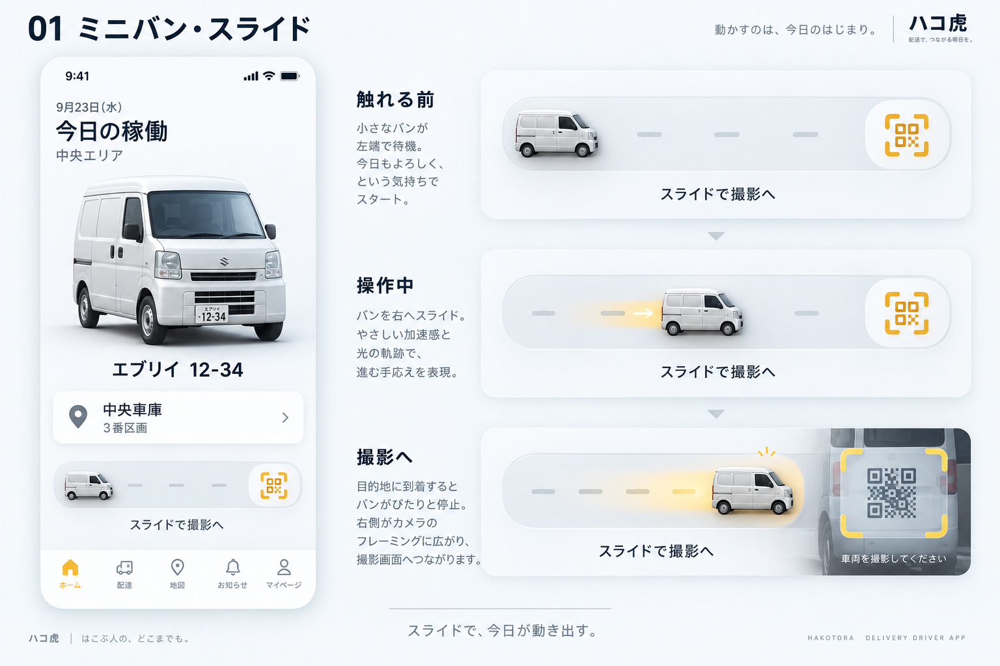
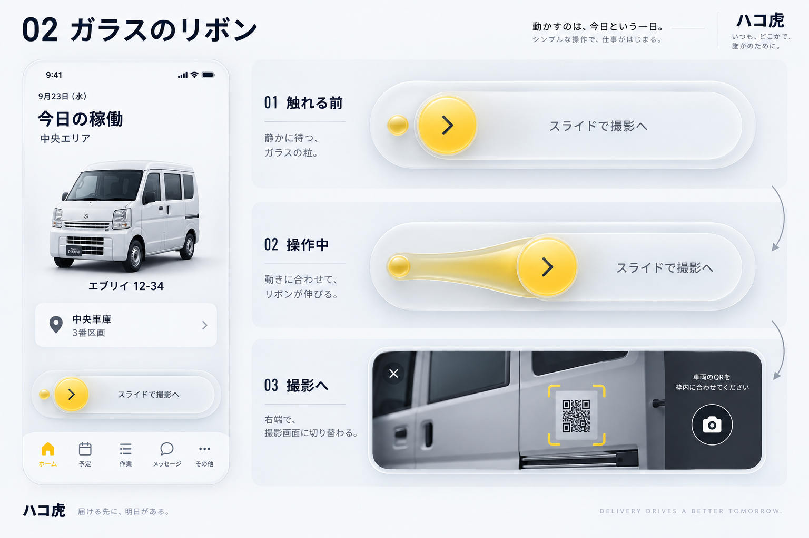
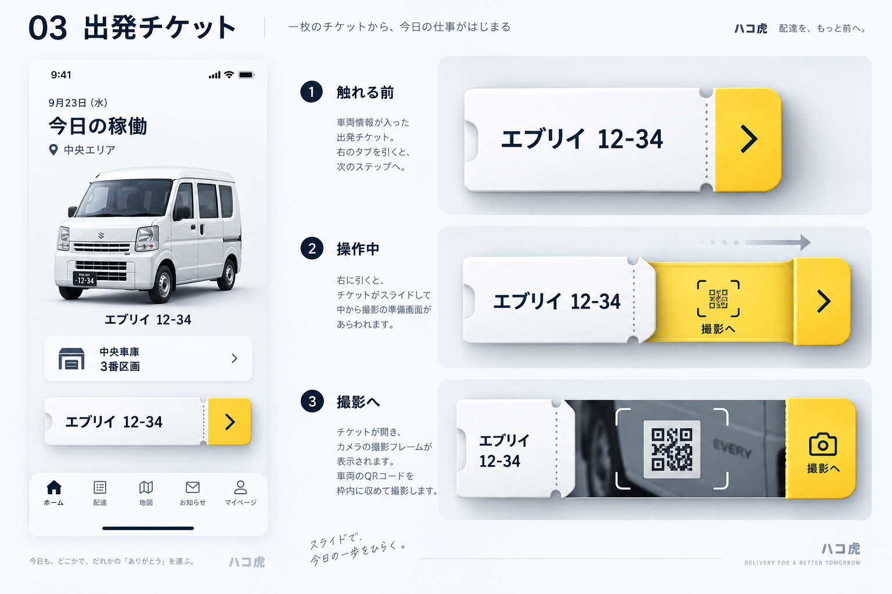
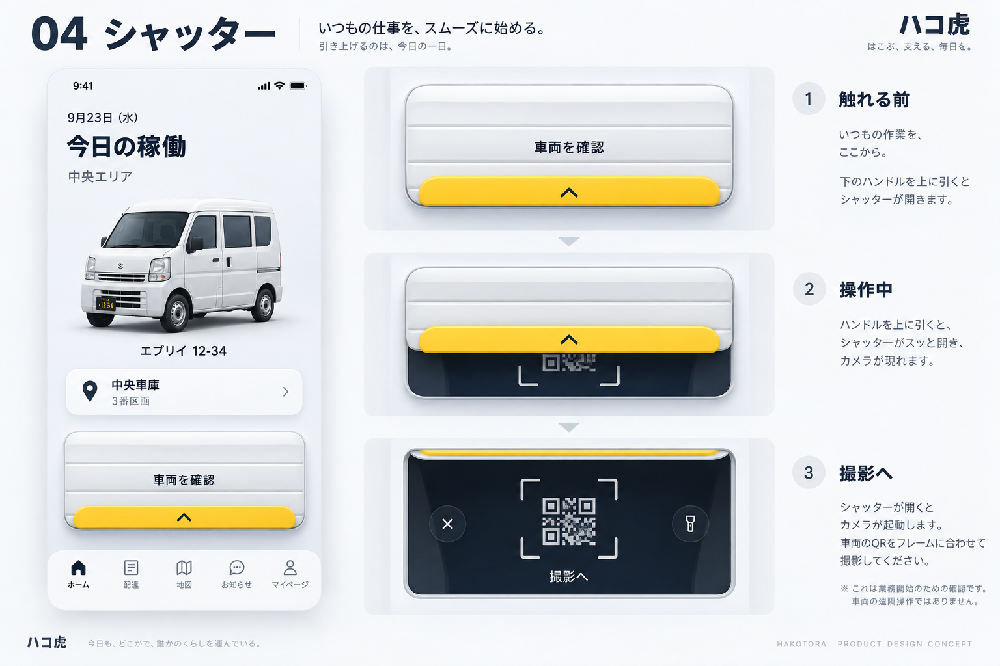
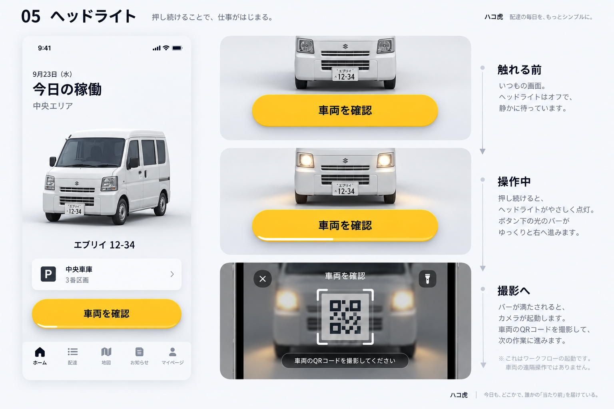
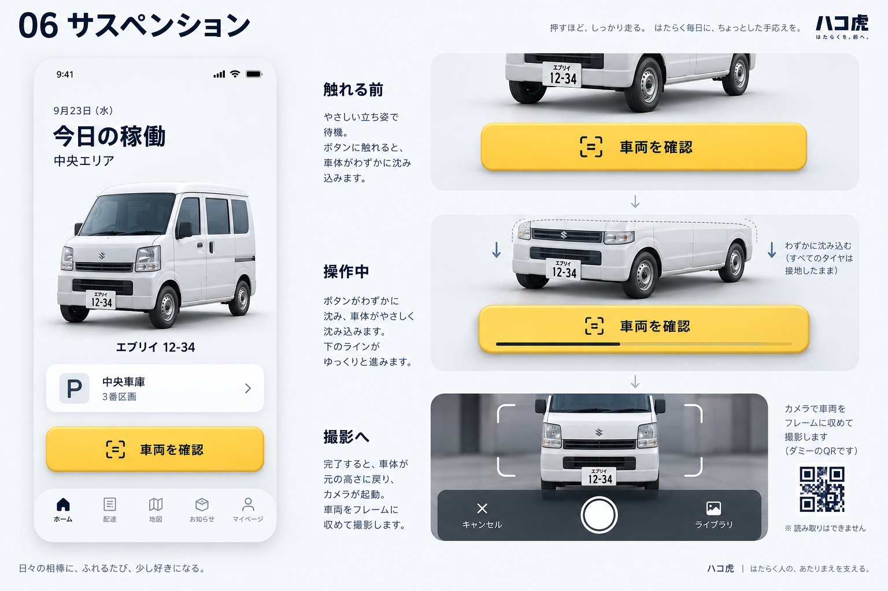

# スライド・長押しを楽しくする6案

2026/09/23。ユーザーのスライド推しを踏まえ、横スライド3案・上スワイプ1案・長押し2案を画像生成。**静止したデザイン案で、アニメーションは未実装**。稼働開始・終了を確定する操作ではなく、QR→必要な車体写真→最後にメーター写真→送信に進む入口。

built-in image_genを使用。6案それぞれ独立した生成リクエスト。最終プロンプト全文は [prompts.json](prompts.json)。出力PNGは生成結果を無加工で保存。参考画面は既存NativeHomePreview/SessionShellReviewの割当車両・駐車カード・背景なしの構成をテキスト指定した。

画像の車種/タブ名/文言/コピーには生成上の揺れがある。図中のQRは使用しない。既存5タブ、認証、QR読み取り方法、撮影条件、確定条件を変更する仕様ではない。特にQR読取は写真の手動シャッター操作を増やす意味ではない。製品にスローガンや常設説明を追加しない。

第一候補は①車のスライド（ハコ虎らしさ）と②ガラスのリボン（簡潔さ）。採用判断/実装はまだ行わない。スライドは解放時に進む・途中取消・ボタン代替を維持し、触覚は短い一度だけを検討する。

## 01 ミニバン・スライド

小さな車を右へ運ぶ。到着時に軽く沈んで、QR読取へ。

実装時の調整: 車が二重に見えるので、つまみ側の車は小さく簡略化する。

## 02 ガラスのリボン

指に追従して帯が伸び、端で離すと滑らかに収まる。

実装時の調整: 実装では反射を控え、文字のコントラストとつまみの位置を優先する。

## 03 出発チケット

車両番号入りの配車票を引き出し、カメラを開く。

実装時の調整: 狭い画面でも指の移動が画面外に出ないようにする。

## 04 シャッター

短く上へスワイプし、隠れていた撮影画面を開く。

実装時の調整: ホームの縦スクロールと競合しやすいため、取っ手からの開始に限定する。

## 05 ヘッドライト

長押しに合わせてライトが灯る。文言は固定、時間は細い横線で伝える。

実装時の調整: ライトは3D上の演出。実車の点灯や始動ではない。

## 06 サスペンション

長押しで車体が少し沈み、完了時に一度だけ戻る。

実装時の調整: タイヤは接地、移動量はごく小さく。動き軽減時は姿勢変化を止める。

確認: 6枚とも1536×1024の生成結果を目視確認。比較ブラウザは `?screen=home-design&board=gesture-concepts`。スライドの触り心地や性能はこの画像では検証できない。

ブラウザ確認: 6枚切替と画像読み込み（1536×1024）、1280/390/320pxのレイアウト・横あふれなしをChrome/Playwrightで検証。ページエラー/外部通信0。アプリ内ブラウザの表示要求はqueued。gallery-*.pngは画像生成物ではなく、この確認の画面記録。
