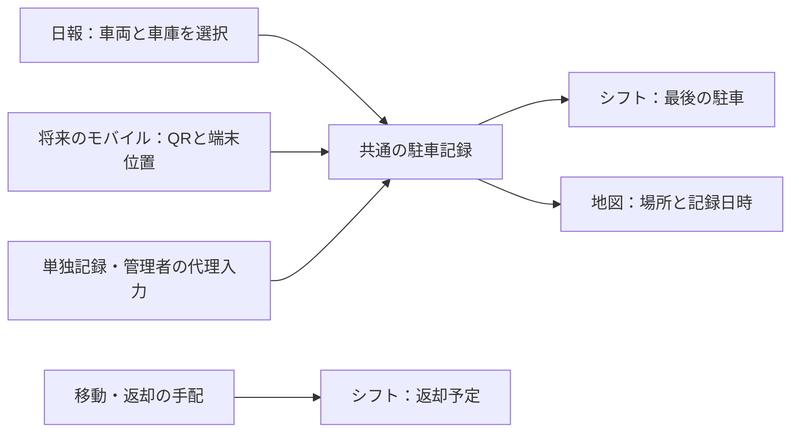

# 日報から始める駐車記録の共通基盤

2026-09-01。ユーザー方針: 当面は日報と一緒に駐車場所を送信する。将来はモバイルの車両識別QR＋端末位置情報から地図へ記録する。**本書は実装計画。今回API・DB・日報フォームは変更していない。**

## 方針

日報を最初の入力窓口にし、駐車の記録自体は車両に紐づく共通の履歴として持つ。日報の備考やコース別の自由項目に埋め込まない。将来のQR、単独の「停めた場所を記録」、管理者の代理入力も同じ保存処理を使う。

実際に停めた場所と返却予定は別データ。日報の送信、仕事の終了、通知の送信、返却期限の到来だけで駐車・返却済みにしない。

## 最初の入力方法

- 日報の最後、送信ボタンの手前に「車の置き場所」を追加する。使用車両は日報の選択を引き継ぎ、プレートで確認できるようにする。
- 通常は登録済みの「豊中車庫」「京都車庫」などから選ぶ。区画があれば選択、鍵・区画の補足メモは任意。「別の場所」は場所名と任意の補足を入力できる。
- 予定の返却先は候補として出せるが、実際に停めた場所として無確認で確定しない。初期版では位置情報の許可やQRスキャンを必須にしない。
- 「まだ使用中」「次の人に引き渡した」「あとで記録」も選べるようにする。これらは提出時の回答として残すが、新しい駐車地点を作らない。後から駐車場所だけを送れる導線を残す。
- 車両なしでは駐車入力は不要。途中の便の提出や同じ車の複数コースで同じ質問を繰り返さず、車の利用単位で1回確認する。会社管理外の車両を安易に会社の地図へ追加しない。
- 対象車両については場所または上記の状況を回答させる案とする。会社ごとの必須／任意の導入設定は別途用意し、位置取得失敗のためだけに日報を止めない。
- ボタンは従来どおり「送信」。選んだ駐車情報も同じ送信に含める。ドライバーに別の地図登録画面への移動を毎回求めない。

駐車日時は「実際に停めた時刻」。通常は送信時点を候補にできるが、後日提出・日付をまたいだ提出・他人への引継ぎでは日時を確認する。日報の対象日0時やAPIの受信時刻へ機械的に置き換えない。過去の日報の数量だけを修正したときは、駐車情報を変更せず保持する。

## 既存コードとの接続

| 既存のもの | コードで確認した状態 | 採る方針 |
| --- | --- | --- |
| 日報 | Web `/submit` の `SubmitPageClientV2` とmobile `DailyReportForm` は `/api/reports/v2` を使用 | この入口に駐車回答を追加。Web／mobileの型・入力整形は `@repo/core` で共有 |
| 日報データ | `daily_reports_v2` は人・日・コース・便単位、項目は `report_entries` | 駐車記録を各コースの項目へ複製せず、送信全体に車両別の駐車回答を添える |
| 地点・区画 | `map_places`、`parking_slots` のSQL・API・地図UIあり | 登録車庫・区画の候補として再利用。駐車用候補を明示し、アイコンだけで用途を判定しない |
| 車両位置の履歴 | `vehicle_positions`、`map_latest_positions`、地図読取APIあり | 既存履歴を駐車申告も扱えるよう拡張する。別の「現在地」マスターを増やさない |
| QR | `vehicle_qr` と `server/vehicleQr/resolve.ts` に失効可能なトークン解決・会社認可あり | QR文字列を車両IDとして扱わず、既存のトークン解決を使う |
| モバイルの位置取得 | `src/location.ts` に前景の位置取得。`WorkScreen` は業務終了後に日報送信 | 取得精度・取得時刻と車両確認結果を共通の駐車入力へ渡す。退勤と日報の二重登録を防ぐ |

確認はリポジトリのコード・migrationに対して実施した。本番DBでの適用状態・実際の受信や地図表示は未確認。

## 保存モデル案

位置の正本は引き続き `vehicle_positions` とし、「位置の観測」と「停めたという申告」を区別する情報を追加する方針。現状は座標必須・sourceはpunch/manual/gpsだけなので、日報項目を足すだけでは成立しない。列名・制約の確定とmigrationは次の実装で行う。

| 保存する情報 | 用途 |
| --- | --- |
| 記録ID・車両ID・使用会社ID | 日報・モバイル・地図が同じ記録を参照する |
| 種別・入力元 | 駐車申告か単なる位置観測か、日報／駐車フォーム／打刻などの入口を区別 |
| 実際の日時 `at`・サーバー受信日時 `created_at` | 遅れて送信されても出来事の順序を変えない |
| 記録者・対象ドライバー | 本人入力と管理者の代理記録を区別 |
| 地点ID・区画ID・名称の保存時点の写し | 地点の変更・廃止後も過去の案内を読める |
| 座標・座標の取得方法・取得時刻・精度 | 登録地点の代表点と端末の測位点を混同しない |
| 車両の確認方法と根拠 | 手動選択かQR確認か。QRの秘密トークンそのものは履歴・ログへ残さない |
| 関連日報・セッション・受け渡し | 複数日報から1件の駐車を参照し、QRと日報の二重記録を防ぐ |
| 再送を識別するID・訂正元の記録ID | 同じ送信を重複登録せず、訂正前の記録も追える |
| メモ | 鍵・区画・目印など、場所名だけで足りない情報 |

登録車庫を選んだ場合は、その地点・区画の座標をサーバーで解決し、地図に表示できる。「登録地点の代表点」として保存し、GPSでその場所にいることを確認した扱いにはしない。通常の区画の割当 `parking_slots.vehicle_id` は定位置であり、実際の駐車記録ではない。

「別の場所」で座標が分からない場合は、場所名を持つ駐車申告として保存できる設計にする。そのため拡張後は駐車申告に限り座標なしを許し、既存の座標観測は座標必須を維持する。地図では位置未確認として扱う。緯度経度を0に変換したり、以前の車庫を新しい場所として再利用したりしない。登録候補へ自動追加せず、必要なら管理者が後で地点を整備する。

「まだ使用中／引渡し／あとで記録」の回答は送信結果・日報との関連として保持し、駐車履歴へ架空の場所を追記しない。提出対象との紐付けの表・形式は実装時に確定する。

### 読取側も同時に対応する

- シフトには「最後の駐車申告」、地図には最新の有効な位置情報を返す。移動中のGPS・出勤打刻・運営のドラッグ位置を駐車済みとは扱わない。
- 新しい駐車申告が座標なしなら、地図は以前の点を現在地として表示しない。履歴の最後の既知地点を出す場合も日時付きの過去情報として明示する。
- `map_latest_positions`、フォールバック読込、地図のsourceの型・表示、シフトの読取を一緒に更新する。同時刻の記録はサーバーで確定した順序で安定させ、`at` だけで不定に選ばない。
- 最新表示はサーバー到着順ではなく実際の日時と訂正履歴から決める。過去の駐車訂正が、その後の別の駐車を上書きしない。
- 本人の駐車申告はその旨を付けて提出時に表示する。日報の承認待ちで翌日の配車確認ができない状態にしない。日報の却下・削除だけで車両の駐車履歴を消さない。

## 送信と整合性

一つの送信要求に日報の `items` と駐車回答を含め、サーバーの共通処理で保存する。駐車情報はトップレベルの車両別配列として設計し、同一車両が3コースに登場しても駐車記録は3件作らない。将来、1日に複数車を使う場合にも拡張できる形にする。初期UIが1車両なら、最後に停めた対象を確認し、全車が同じ場所へ帰ったことにはしない。

日報の駐車回答には「新しい記録」「既存記録を維持・参照」「今回は未記録」の区別を持たせる。駐車欄がない旧クライアントや過去日報の再提出は、保存済みの駐車を維持する。日報の車両を変更した場合は関連を再確認し、既存の駐車履歴の車両IDを黙って変更しない。

現行 `/api/reports/v2` はコースごとのヘッダー・項目を個別に保存するため、送信全体のトランザクションではない。この後に駐車INSERTを足すだけ、またはクライアントから駐車APIをもう1回呼ぶだけの実装にしない。新経路は日報ヘッダー・項目・駐車回答・関連を同一DBトランザクションで確定する。成功レスポンスは駐車を含む保存結果が確定してから返す。日報の計算・請求・承認条件は変更しない。

位置取得失敗や場所未確認は明示的な未記録回答として日報を保存できる。これは保存エラーを成功扱いすることとは分ける。DB保存失敗は入力を残して再送し、再送IDにより日報・駐車を二重登録しない。同じIDで内容が違う場合は競合として扱う。新しい内容での再送・訂正は別の要求として履歴を残す。

モバイルの業務終了と日報は現状別の保存。業務終了だけ成立して日報が失敗したときは、勤怠を巻き戻さない。将来QR経路で駐車記録まで確定した場合は、その記録IDを日報へ渡して参照し、日報再送で別の駐車を作らない。シフトのない日に `DailyReportForm.submit()` が保存せず成功を返す既存仕様があるため、日報なしの駐車は共通処理への単独入口から保存できるようにする。

## QR・端末位置への拡張

- 車両選択の入力を、QRのトークンをサーバーで解決した結果に置き換える。場所選択は引き続き使え、GPSは場所を補う。取得できても一番近い車庫へ無確認で確定しない。
- GPSの許可拒否・取得不可・屋内での誤差があっても、登録場所・場所名で記録できる。駐車時の単発取得を基本とし、常時追跡は今回の基盤に含めない。
- 端末の測位時刻・精度と駐車日時を別に持つ。後日の日報送信時に自宅などで取得した座標を、過去の駐車場所として保存しない。未来日時・異常値・nullの数値化も拒否する。
- QRの再発行・失効・貼付確認待ちは既存の検証に従う。QRを読めたことだけで閲覧・記録権限を与えない。オフライン入力も送信時に認可を再確認し、自動的に検証済み扱いにしない。

## 権限・プライバシーと移行時の注意

- 本人の提出対象、車両の利用関係、会社、地点／区画の会社一致をサーバーで確認する。関連先の日報・セッション・手配IDも検証する。ブラウザの車両候補だけを認可の根拠にしない。
- ドライバー向けには駐車候補を絞った読取を用意する。既存の管理者向け地図APIの権限を弱めたり、全地点・全社車両を開放したりしない。
- 貸与車両は利用があった日の認可と現在の提出権限を照合する。既存QR用の認可は使用不可車を拒否するため、整備中・返却後の過去記録まで禁止する条件をそのまま流用しない。記録の訂正・代理入力の権限を別途定める。
- 所有会社向けに借用中車両の位置を見せる場合も、場所・日時など必要な範囲だけを返す。他社の日報、記録者の詳細、鍵のメモを一緒に公開しない。車両位置は利用者・自宅等と結びつくため、保存期間と閲覧範囲を決める。
- 既存 `recordPunchPosition` は座標を `Number()` で変換する。新基盤へ共用する前に、null／空文字が0になるケース、GPS状態、精度を検証する必要がある。また既存の位置記録は失敗をログに残すだけなので、新しい「駐車も保存成功」の保証にはそのまま使わない。
- 旧 `parking-location-flow.md` の `org_parking_places`／`vehicle_parking_locations` は未作成の旧案。重複する地点・現在地テーブルを作らず、現行の `map_places`／`parking_slots`／`vehicle_positions` との互換性を先に検証する。

## 実装する順番

1. **保存基盤**：既存位置履歴の拡張、駐車の共通入力・検証・認可、日報との関連、送信の一括確定・再送制御、最新情報の読取。migrationは互換読取を先に入れてから新しい書込を有効にする。
2. **日報を入口にする**：実際のWeb日報フォームを再利用した隔離プレビューで、車庫選択・別の場所・未記録・日付跨ぎ・再提出・保存失敗を試せるようにする。既存のシフトプレビューへ架空の駐車記録を反映し、PC／スマホで確認する。
3. **本番の読取・表示**：シフトの最後の駐車と返却予定を分離、登録地点なら地図へ反映。本人・代理・別会社、座標なし、古い提出、複数コース、同日乗換え、日報却下、同時訂正を検証する。
4. **モバイル**：既存QR・GPS・業務終了と同じ基盤を接続。実機で権限拒否、屋内、通信失敗、日報だけの再送を検証する。QR必須化や常時位置取得は別の判断とする。

実行したのはコード調査と設計の更新のみ。migration作成・適用、コード実装、新しいプレビュー、実データ取得、通知送信・デプロイは今回行っていない。
