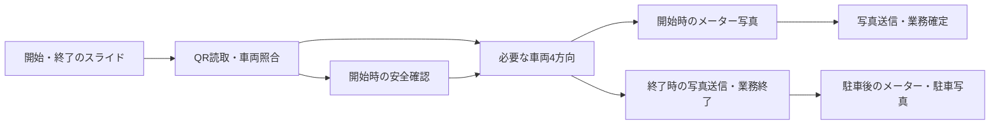

# QR・車両撮影の連続フロー案

2026/09/25。 [共有されたReact Native実装案](https://chatgpt.com/share/6ab53999-94d4-83ee-8684-e6e5cc5718ce)を、現行の `CaptureFlow` と [開始・終了撮影の確定手順](mobile-capture-parking-lifecycle-2026-09.md)に照らして具体化する。画面・判定・APIの実装前の設計案。本番の撮影義務や開始・終了条件は変更しない。

## 現在の土台と不足

- 本体の `CaptureFlow` は1つの `CameraView` を維持し、QR→安全確認→車両4方向→最後のメーター写真を進める。方向順は**前→右→後→左を維持**する（2026/09/25ユーザー確認）。撮影後は毎回「撮り直す」「この写真を使う」で確認する。
- QRは `onBarcodeScanned` で**データを読めた後**に `onQrScanned` へ渡す。`false` の場合はQR画面に留まるが、呼出元のエラーがモーダル内に表示されない。読取・照合・開始確定を1つの成功表示にしない。
- `assessPhoto` と `assessMeterPhoto` は接続口だけで、本体の `WorkScreen` は解析器を渡していない。Expo Goの隔離プレビューは品質結果を架空の設定で切り替える。車体向き・ブレ・枠外の自動判定が動作した証拠にはならない。
- **終了フローの未移行**: 現行 `WorkScreen.startCapture("out")` は `workCaptureSteps("out", true)` をそのまま使い、終了キャプチャ内にメーターを含む。一方、採用済みの業務手順と隔離プレビューは駐車後のメーター撮影とする。新しい撮影体験を本体へ接続するときは、先に終了のメーターステップを駐車後へ移し、保存・再開・失敗復帰を合わせる。
- 側面の横持ち案内と保存写真の横向き確認、5種類のメーターガイド、メーター写真の即時品質状態は既にある。開始/終了後の保存整合性と個人別点検要否は別設計で未完。

## 操作の骨格

上図の順序は既存の業務契約を示す。点検要否はサーバーのpolicyが確定するまで本体の義務を勝手に変更しない。終了メーターは駐車後であり、撮影フロー中へ戻さない。

## QR画面の状態

| 状態 | 画面 | 次の条件 |
| --- | --- | --- |
| `searching` | 四隅のガイドと「車両のQR」。読取ボタンは置かない | カメラがQRデータを返す |
| `decoded` | ガイドを少し縮め、読取を視覚的に示す | 直ちに照合へ。カメラの連続イベントを止める |
| `verifying` | 「車両を確認中」。戻る操作は残す | `onQrScanned` の結果 |
| `verified` | 車両番号を短く表示して次工程へ | 本人・会社・車両・用途の照合成功のみ |
| `invalid` | 「このQRでは車両を確認できません」＋再スキャン | 別のQRを読むか代替経路へ |
| `error` | 通信/カメラ失敗の理由と再試行 | 再試行または代替経路へ |

Expo Cameraの `onBarcodeScanned` はデコード済みのデータを返す。共有案の「QRらしいものを見つけた」段階を、このイベントだけで実装済みと表現しない。`bounds` や `cornerPoints` は空の場合があるため、ガイド追従は取得できたときだけ行い、なくても中央ガイドで操作を続けられるようにする。`invalid` と `error` の後は重複抑止を解除し、同じ画面で再スキャン可能にする。

現行の `onQrScanned: Promise<boolean>` では照合拒否と通信失敗を区別できず、失敗文言が `WorkScreen` 側に留まる。実装では結果を `valid` / `rejected` / `retryableError` の判別可能な型にし、QRモーダル内で理由と再試行を表示する。読取ごとに世代番号を付け、取消・手動経路への移動後に届く応答は画面を進めない。車両IDと表示番号は照合成功の結果だけから取得し、QR文字列から推測しない。

## 車両4方向の1枚ごとの状態

| 状態 | 操作・表示 | 次の条件 |
| --- | --- | --- |
| `aiming` | 対象方向の線画と短いラベル、シャッター。側面のみ横持ち案内 | 本人が撮影 |
| `capturing` | シャッターを一時停止 | 写真保存成功/失敗 |
| `assessing` | 撮影画像を保持し、任意の即時品質確認 | 判定結果/期限切れ |
| `review` | 写真、撮り直し、採用。高確度の問題だけ理由を示す | 本人が採用または撮り直し |
| `accepted` | 小さなサムネイルと次の方向を表示 | 次方向へ進む |

2026/09/25の選択: **判定できた良い写真だけ自動で次へ進める**。撮影そのものは本人がシャッターを押す。解析器が未接続の間は本人の採用を維持し、「良い写真」として自動進行しない。実写真でしきい値を検証した後、車体全体・対象方向・鮮明さを高確度で確認できた写真だけ、短い撮影済み表示を経て次の方向へ進む。問題あり・判定不能・期限切れは写真を保持して撮り直し/目視で採用を選べる。傷の有無や業務上の合否は、この即時品質判定に含めない。

各方向の採用済みサムネイルを残し、最終送信前にタップしてその方向だけ撮り直せるようにする。自動進行後にも戻れることが条件。撮り直し・取消後に古い解析結果が届いても、写真revisionと世代番号が一致しなければ採用しない。最終送信で必要方向の写真枚数と車両IDを再確認する。

## メーター写真の自動進行

2026/09/25の選択: 車両4方向に加え、**メーターも品質確認が通った写真だけ自動で次へ進める**。現在の `MeterQualityResult` にある `odometerReadable` と `fuelReadable` が両方trueで、反射・ブレ・欠け・暗さ・TRIPのみ・不確実のissueがなく、同じ写真revisionの判定が期限内に返った場合に限る。走行距離の数値が正しいか、燃料残量がどの値かはここで確定しない。数値の抽出と運営承認は既存の非同期処理へ渡す。

判定不能・通信失敗・期限切れ・片方しか見えない写真では自動進行せず、撮影画像を保持して「撮り直す」「目視で確認して使う」を表示する。自動進行後も最終送信前にメーターのサムネイルから撮り直せる。現状の `WorkScreen` は `assessMeterPhoto` を渡していないため、接続と実写真の評価が終わるまでは毎回手動確認を維持する。

前後左右の線画は既存の `VanGuideOutline` を再利用する。端末姿勢センサーは水平・横持ちを補助するが、車に対する真正面/真横を証明しない。車体向きの判定には保存写真の解析と車種差の検証が必要。3D車の回転は次に撮る面を示す補助演出とし、描画失敗や動き軽減時も線画・文字で進める。

## フィードバック

2026/09/25のQR演出: 中央のQR角印が検出時に実際のQRへ吸着する。車両照合の成功が確定した後だけ、四角い枠が縮んで円になり、チェックが現れる。約1秒表示して次の工程へ進む。拒否・通信失敗では円を出さず四角へ戻し、同じ画面で再試行する。動き軽減設定では中間動作を省く。ブラウザの隔離プレビューは見本QR表示と演出再生のみでカメラを使わない。

角座標がある場合は、3つの角印の位置と間隔を検出QRに合わせ、外枠も検出範囲へ寄せる。iOS/Androidで角の並び順が違うため、四隅を座標で並べ直す。角座標が欠落した場合だけ固定枠で読取を続ける。位置が枠外または小さすぎる場合は読取確定を待つ。iPhoneの隔離プレビューだけは実カメラから任意のQRを読み取るが、照合結果は架空である。

実機で外枠のずれと小さいQRでの角印の縮みを確認したため、認識時にはプレビュー映像を短く固定し、128pt未満や枠外のQRでは進まず近づける案内を出す。読取枠は直角とし、成功時だけ塗りのない白い円・チェックへ変形する。

斜めのQRでは検出四隅を4本の線で直接結び、台形になってもQRの外周へ吸着する。QRの3つの角印も検出四隅から位置を求め、意味のない右下の点群は置かない。成功時は角印を緑へ切り替え、線が消え、塗りのない太い緑の円と濃い影を付けた緑のチェックに変わる。四隅が得られない端末は中央演出へ退避する。

- QRデータ読取と車両照合成功を別の視覚状態にする。触覚は出せる端末でのみ補助し、失敗を毎回強い振動で知らせない。
- 撮影成功では画像と次方向を主な手応えにする。途中の状態を常設の説明文で重ねない。
- iOSではカメラ使用中などに触覚エンジンが無反応になる条件がある。現在のExpo Goではカメラ外でも短い触覚が無反応なので、触覚がなくても状態と次操作が分かる画面にする。実際の触覚は署名済み開発ビルドで確認する。

## 最初に作る単位と確認方法

1. **QR状態と失敗復帰**: 本体と隔離プレビューの表示を共通化。無効QR、照合拒否、通信失敗、取消後の遅着、連続検出、代替経路を確認する。
2. **終了メーターの配置**: 本体だけに残る終了キャプチャ内のメーターを、採用済みの駐車後手順へ移す。終了・日報・駐車の独立した失敗復帰を維持する。
3. **4方向の進み方**: 既存の撮影順と必須条件を維持し、撮影済みの面・次の面・撮り直しを明確にする。横持ち/縦写真/暗所/広角/動き軽減をPC幅・スマホ幅の隔離プレビューと実機で監査する。
4. **品質判定の実証**: 実写真と正解ラベルを用意し、車体のブレ・はみ出し・向き、メーターのODO/燃料表示・反射・暗さの誤判定率と処理時間を別々に測る。外部AIや新規ネイティブ依存は、その結果と送信先・保持期間を確定してから選ぶ。
5. **自動進行の導入**: 実写真の評価で基準を満たした車両方向とメーターだけ確認を省略する。毎回の手動確認との所要時間・誤採用・撮り直し率を比較する。自動シャッターは今回の対象外。

プレビューは既存の `ui-preview/CapturePreview.tsx` とブラウザの `scripts/mobile-preview/` を土台にする。実カメラ・実QR・品質精度・触覚はExpo Goの架空フローだけでは合格にしない。

## 後続の判断

- 自動進行の採用しきい値は実写真の評価で決める。数値だけ先に固定しない。
- 車体品質解析を端末内に置くか、短時間のサーバー解析にするかは、遅延・誤判定・写真の送信先と保持条件を比較して決める。

参考: [Expo Camera](https://docs.expo.dev/versions/latest/sdk/camera/)、[Expo Sensors](https://docs.expo.dev/versions/latest/sdk/sensors/)、[Expo Haptics](https://docs.expo.dev/versions/latest/sdk/haptics/)。
