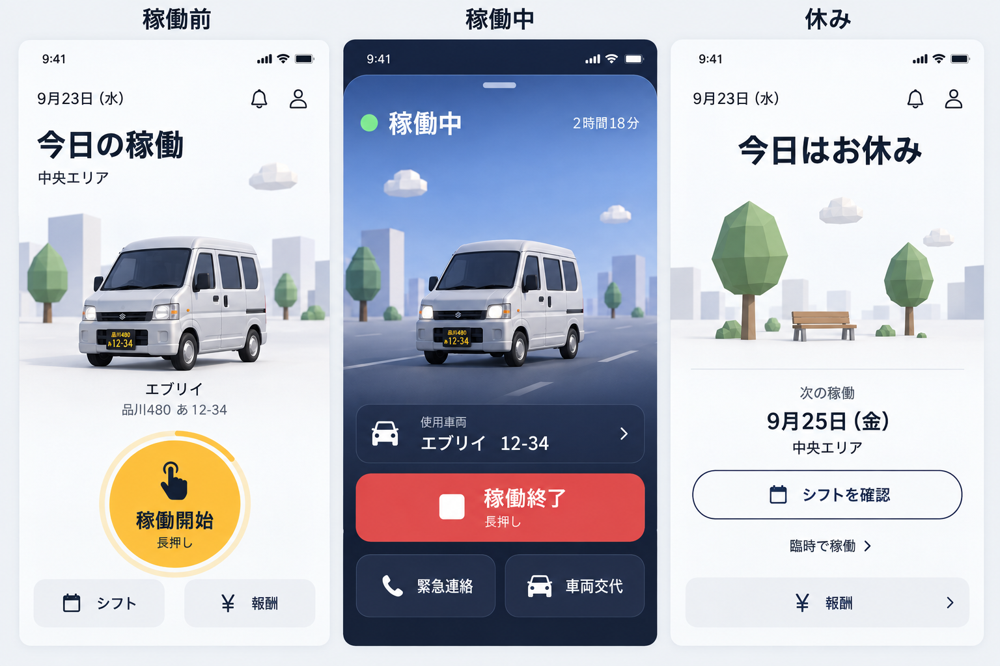
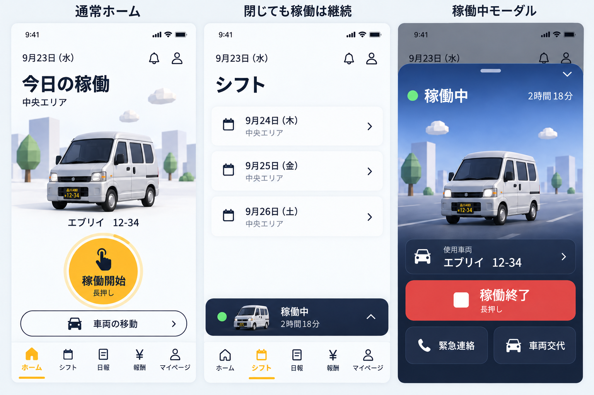
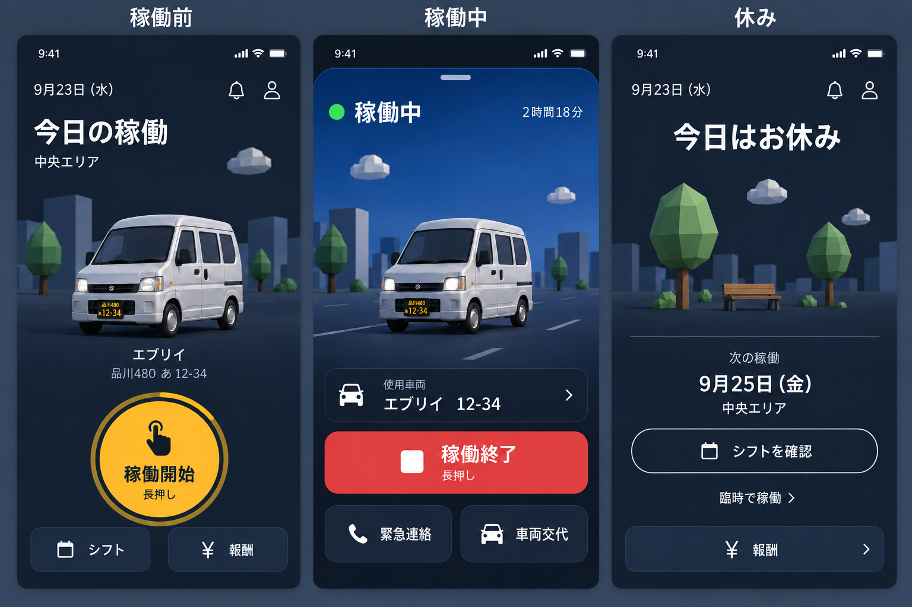
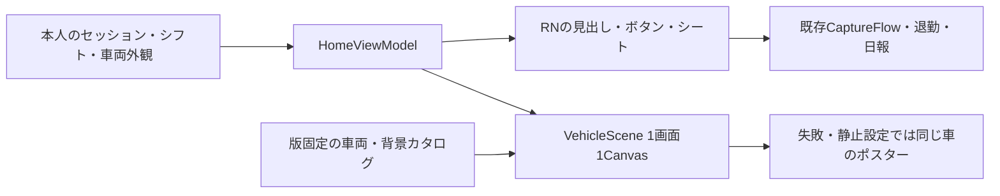

# ドライバーホームの3Dシーンと背景素材

> **デザイン検討の履歴（2026/09/28整理）**: 初期の下部タブ案と、後続の右上メニュー・地図カード・休みの3D実装が同じ文書にある。画面構成は後の日付の節と現行コードを優先する。撮影・日報・駐車の業務順序は[開始・終了撮影と駐車](mobile-capture-parking-lifecycle-2026-09.md)を参照する。

2026/09/23。**v2・3状態の色/車の方向性は了承。通常画面は下部タブ、稼働中は下から開くモーダルへ修正**。ダークモードは後続実装を前提に設計。ユーザー添付「Anchor 2026-09-23 10.07.48.png」を参照。ネイティブ本体の画面差し替え・3Dライブラリ追加・外部公開は今回まだ行わない。

## 目指す画面

使用する軽バンを中央の主役にする。稼働中は車輪と周囲の景色が動き、稼働前は同じ車が停まっている。休みの日は「今日はお休み」と次の予定を見せる。**稼働開始の長押しを維持する**。

画像は生成したデザイン案であり、GLBの実レンダリングや実装済み画面ではない。車種の細部、ナンバー字形、指アイコンは実装時に既存GLB・プレート共通実装・Font Awesomeへ合わせる。架空ナンバー/コースを使用する。

初版画像には下部タブがない。色・車の方向の参考として残し、**画面の構造は次節のモーダル/タブ設計を優先**する。

### 合意した方向

- 稼働前: 明るい背景に使用予定の軽バン。コース、車番、円形の稼働開始ボタンを主役の近くへまとめる。
- 稼働中: 添付に近い青い空と濃紺の下部。中央の軽バンを固定したカメラで見せ、背景を流す。時間は状態名の横へ小さく置く。
- 休み: 明るい同じ世界観で、木・ベンチ・雲の静かな景色。割当車があるようには見せず、次の稼働とシフト確認を優先する。
- 案の色: 日常面 `#F6F8FB`、本文 `#192333`、開始 `#FFC52C`、空 `#779CD6`、稼働中の下部 `#18263E`、終了 `#F44553`。日本語はOS標準のサンセリフ。見出し24〜28pt、本文16pt前後、補助12〜14pt。これは実画面で調整する出発点。
- 車は画面幅の約60〜70%、主役の表示領域は高さ300〜360ptを目安。小画面では背景の上下を詰め、車の形と主要ボタンを優先する。文字拡大時は内容をスクロールできるようにし、3DにUIを焼き込まない。
- ヘッダーと操作はRNで描き、3Dは中央の景色のみ。背景は操作を受け取らない。実際に開閉できるシートにだけドラッグハンドルを付ける。

## 通常画面・ミニバー・拡大モーダル

ユーザー補足: 「稼働中モードとは、Spotifyの再生中のように、下からモーダルが出てきている状態」。稼働状態と、稼働中画面が開いているかを分離する。

- 通常のアプリは下部タブを持つ。初案はホーム/シフト/日報/報酬/マイページ。通知はヘッダー入口を維持。現在日報はホーム内のフォームなので、日報タブは既存フォーム/一覧の再配置として設計し、別の保存処理を作らない。
- 車両移動の開始経路は稼働開始と分ける。通常ホームには表示せず、Base/adminで移動担当に指定された本人だけに入口を出す設計とする。[移動モード設計](mobile-vehicle-move-2026-09.md)。
- 稼働開始が成功したら、下から拡大モーダルを開く。3D走行・使用車・終了操作を表示し、タブバーを覆う。
- 下向きスワイプ/閉じる操作で縮小する。**閉じることは稼働終了ではない**。通常画面とタブが現れ、タブの上に「稼働中・経過時間・車番」のミニバーを残す。ホームでも他タブでもタップして再展開できる。
- モーダルを閉じてもタブの選択位置、フォームの入力、セッションは保持する。タブの切替や暗転領域への操作で終了APIを呼ばない。終了は明示した終了フローからのみ行う。
- ドラッグ開始はハンドル/上部からに限定し、フォームのスクロール・地図操作・長押しと競合させない。下向きボタンとスクリーンリーダー用の操作名も用意する。Reduced Motionでは滑らかな移動を短縮/省略する。
- カメラ、日報入力、緊急連絡の確認は上位のフローとして管理し、その間の下スワイプで入力を捨てない。3Dは非表示で停止する。
- 「車両の移動」も同じ表示シェルを使うが、ミニバー/モーダルには「車両移動中」と明示する。青い稼働・緑系の移動を候補とし、色だけで識別しない。

## 2026/09/25 稼働前ホームを地図と車両の統合カードへ

ユーザー提供の統合カード案に沿い、駐車場所の地図をカード上部、車両とナンバーを中央、駐車場所の名称・住所を下部にまとめる。開始リボンはカードの直下へ置く。駐車場所行から選択した地図アプリで正確な地点を開く。位置未確定では地点を装わず「位置を確認中」とし、地図への遷移を止める。

通常のホーム上部は日付と「今日の稼働」を外し、既存ロゴと「ハコ虎」を共通ヘッダーに置く。右上のベルから通知インボックスを開き、もう一方のボタンはiPhoneでSwiftUIの標準メニュー、AndroidでComposeの標準メニューを開く。メニューにホーム・シフト・報酬・マイページを集め、隔離試作では下部タブを外す。稼働前は時間帯に応じた「おはようございます」「お疲れ様です」の下に、控えめな「本日の担当」と当日コース名を並べる。コース名だけを単独で置かない。地図ピン・色面・枠は付けない。iPhoneの共通アイコンはSF Symbols、AndroidはFont Awesome 6を使う。QRの完了マークは専用アニメーションとして維持する。地図を縦に広げ、画面下部の空白を抑える。隔離プレビューの「中央エリア」は架空の当日コース名で、本番接続時は当日の割当コース名を取得する。休み・稼働中・終了後は状態を示す見出しを維持する。

隔離プレビューでは公開駐車場を架空の割当地点に使い、iPhoneのExpo GoではApple MapKit、ブラウザの `--mapbox` モードではMapbox GL JSで周辺地図を表示する。両方とも地図の移動・拡大と駐車地点への復帰ができ、既存の車両モデルを見下ろす角度で描き出した透過画像と共通ナンバープレート・駐車場所名の吹き出しを地図座標に固定する。吹き出しの「に駐車中」は小さくする。地図上の車両と重複しないよう、カード下部は車名とナンバーのみ。位置未確定や稼働中は従来の車両表示へ戻す。ブラウザの接続なし・描画失敗時はMapbox Static Images API、さらに画像取得失敗時はローカルの概略図へ戻す。いずれも実在する駐車区画・車両位置を表すものではない。本実装では運営が確定した駐車地点を取得し、地図の中心・車両マーカー・表示範囲をその地点と一致させる。

MapKitのAppleロゴ・法的表示は地図内で隠さない。操作できるMapbox GL JS地図では標準のロゴと帰属表示を維持する。静止地図へフォールバックした場合だけAPIの `logo=false`・`attribution=false` を用い、カード内の地図に接して `© Mapbox`・`© OpenStreetMap`・改善リンクを出す。配布アプリにMapbox SDKを追加する理由は現時点ではない。Mapboxの公開キーは隔離ブラウザの起動時だけ読み、秘密キーや本番APIに接続しない。

地図上の車は立体的に描き出した静止画像で、地図の傾斜や回転に追随するライブ3Dモデルではない。ホームカードの現在の画角では静止画像を採用し、MapboxネイティブSDKへの移行は保留。将来、地図カメラの傾斜と一緒にGLBを立体回転させる要件が出たら、MapboxのModelLayerとカスタム開発ビルドで再評価する。

iOSの地図ラベルはアプリ独自の言語指定をしておらず、端末の地図環境へ任せる。英語設定のiPhoneでは英語表記を実機確認。Androidは同じ `react-native-maps` でもGoogle Mapsで、ラベルは端末設定と地点に従う。ブラウザMapboxは `ja` を明示して日本語表示を確認。Androidの配布版にはGoogle Maps SDKのAPIキー設定・実機確認が必要。

「車両の移動」は通常ホームから一旦外す。移動モードのQR、撮影、ミニバー、終了は設計・試作コードとして維持する。Base/adminの依頼で担当者と有効期間を決め、サーバーが本人の開始権限を返すまで入口を出さない。端末だけのフラグを認可条件にせず、開始APIでも本人・車両・依頼の整合性を再検証する。管理画面の設定UI・API接続は後続。

### 2026/09/26 休みの日のホーム

休みの日は車両カード・地図・開始リボンを出さず、「今日はお休み」とベンチを中心にした3Dの休憩スペースを表示する。ユーザーが選んだベンチの3Dを残し、横ドラッグで視点を小さく動かし、ベンチや木をタップすると短く反応させる。目的や報酬、操作説明文は置かない。シーンの下には次の稼働日、架空シフトのコースと集合時刻、報酬と臨時稼働への控えめな入口を置く。通知は共通ヘッダーのベルを使う。次回予定なしも同じ位置で扱う。動きの軽減設定では自動的な動きを加えない。

横ドラッグは景色を指と同じ方向へ動かす。将来案として、休みの景色をダブルタップすると専用の3D空間へ入り、軽バンで自由に遊べる体験を検討する。通常のホームから偶発的に遷移しない入口、明確な戻り方、業務中の稼働状態との分離を設計してから着手する。今のベンチ画面には導線やゲーム要素をまだ加えない。まず既存のThree.js/Expo GLで成立する範囲を試し、必要性が明確になったときだけ別のエンジンを比較する。

遊び方三案・段階的な実装・エンジン比較は隔離プレビューの独立ページ `?screen=rest-playground` にまとめる。表示中のベンチは現行 `SceneSurface mode="off"` の実物で、切り替えられる案は構想表示のみ。

現時点の休み・次回予定は確認用fixtureで、割当がないだけの状態から休日を推定しない。次回予定の実データ接続は休み判定元と合わせて後続で行う。

現行 `App.tsx` はドライバー側がタブなしStack、`WorkingMiniBar.tsx` はホーム以外からホームに戻すだけ。`WorkSessionContext.tsx` と状態共有を再利用し、`BottomTabBar.tsx` は管理用もあるためドライバー用変更で管理を壊さない。新構造は `DriverTabs + ActiveSessionMiniBar + ActiveSessionSheet` を共通シェルへ置き、WorkScreenから開始/終了処理を分離する案。

状態を `session: none | work | move | private/unknown`、`sheet: collapsed | expanded`、`theme: light | dark`、`selectedTab` に分ける。取得失敗を `none` に潰さない。復帰はサーバーのセッションを正として再同期し、モーダル開閉やテーマだけを理由に位置追跡を止めない。

## iOSはApple標準UIとLiquid Glassを優先する

2026/09/23 ユーザー指定: iOSのタブ切替などはApple純正UIコンポーネントを活用する。**通常タブ・シート・標準操作はOSの実装、車の3Dシーンと800ms長押しはアプリ固有の表示/操作**として組み合わせる。前掲の画像とブラウザモックは配置/操作の参考であり、タブの材質・角丸・選択時の動きは純正UIを正とする。

### 採用範囲

| 部分 | iOSの方針 | 維持する契約 |
|---|---|---|
| 下部タブ | UIKitの標準タブを使うNative Bottom Tabs。iOS 26以降は対応ビルドでLiquid Glass | ホーム/シフト/日報/報酬/マイページの意味・入力保持 |
| 稼働/移動ミニバー | タブの `bottomAccessory` を第一候補にする | タップでモーダル展開。稼働/移動の状態名を明示 |
| 稼働/移動の拡大画面 | 既存native-stackのmodal/formSheetをPoCで比較。標準のドラッグ/閉じる動作を活用 | dismissは縮小だけ。終了APIは呼ばない |
| メニュー・確認・日付/選択 | 必要箇所ごとに標準コンポーネントを採用。SwiftUIが適する場合はSDK57の `@expo/ui/swift-ui` を個別評価 | 共通の業務処理、短い文言、取消時の入力保持 |
| 3Dシーン/開始ボタン/終了操作 | 3DとRNの独自表示を維持。ガラスは必要な操作領域に限定 | 車を見やすく、開始アンバー/終了赤、長押し継続 |

Appleは、Liquid Glassをコンテンツ上の操作・ナビゲーション層として扱い、継続的な機能をタブのaccessoryに置く例を示している。この考え方に沿って稼働ミニバーを配置し、全カード/日報本文/3D背景をガラスにする設計にはしない。[Apple WWDC25: Get to know the new design system](https://developer.apple.com/videos/play/wwdc2025/356/)。

### 現行構成での実装候補

現在はExpo RouterではなくReact Navigation。ローカル実体は `@react-navigation/bottom-tabs 7.18.14`、`@react-navigation/native 7.3.14`、`react-native-screens 4.26.2`、Xcode 26.6。`@react-navigation/bottom-tabs/unstable` に `createNativeBottomTabNavigator` と `bottomAccessory` の実装/型が存在することを確認した。**Router全面移行を前提にせず、現在のNavigationContainerと認証/登録ゲートを保ったまま試す**。

[React Navigationの公式文書](https://reactnavigation.org/docs/native-bottom-tab-navigator/)ではiOSはUITabBarController、Liquid GlassはiOS26以降/Xcode26以降が条件。APIはunstableでminor更新でも変わり得るため、採用時は版を固定してDriverTabsの薄いアダプター内に閉じる。文書は開発ビルドでの検証を案内しており、Expo Goで読み込めることだけでは採用完了にしない。今回は依存追加/更新・native画面の変更なし。

- iOS26以降のaccessoryは `regular / inline` の2配置を想定する。ローカル実装では両方の内容がマウントされ得るため、セッション取得・GPS起動・タイマーを各accessoryに持たせない。共通providerの値を描画するだけにする。
- スクロール連動のタブ縮小は任意の後続調整。初期PoCは `tabBarMinimizeBehavior: 'none'` でタブと状態の見つけやすさを確認する。縮小を有効にしても用途・車番・戻る入口を保つ。
- iOSの標準sheetを閉じたとき、タブ選択とミニバーへ復帰する。ネイティブ遷移の連打・インタラクティブdismiss・入力途中・カメラの重なりを試す。ミニバーから全面へ1枚の面が連続変形する演出までは標準APIだけで保証しない。
- アプリが指定するアイコンは既存規約のFont Awesomeを維持。native tabの `type: 'image'` へ単色のアイコン画像を渡す方式を検証する。独自タブViewを上から被せて標準動作を隠さない。
- iOS旧版はそのOSの標準タブ、accessory非対応時は共通ミニバーを重ならない位置へ配置。AndroidはAndroidの標準ナビゲーションを候補とし、ガラスを必須にしない。
- 独自操作面に必要なら `expo-glass-effect` のGlassViewを検討する。純正タブにガラスViewを重ねない。利用可否はOS番号だけで決めず、コンパイル/実行環境の可否と透明度設定を確認する。[Expo SDK57 GlassEffect](https://docs.expo.dev/versions/v57.0.0/sdk/glass-effect/)。

### ダーク・アクセシビリティと検証

OSのライト/ダークとシステム色を標準コントロールに反映し、後続のアプリ内テーマ設定とも同期させる。「透明度を下げる」「コントラストを上げる」「視差効果を減らす」、文字拡大、VoiceOverを尊重する。ガラスが無効な環境でも操作境界と文字が読める面を用意する。

次のnative PoCで、iPhoneのタブ切替、稼働/移動ミニバー、sheet開閉、カメラ/入力/キーボード、タブ再選択、背景復帰、ダーク/透明度設定を確認する。3DのGPU負荷とガラスを同時に表示した性能も測る。ブラウザのCSSぼかしや生成画像を、この純正UIの実機検証の代用にはしない。

## ダークモードを後から追加するための設計

ユーザー確認: 「いいと思いますが、ダークモードも後々実装したいです」。初回は上記の方向を採用し、ダークモード対応自体は後続作業とする。**業務状態とテーマを独立させる**。稼働中の青い画面を、そのままアプリ全体のダークモードとは扱わない。

- `HomeState`（稼働前・中・終了・休み等）と `ColorTheme`（light / dark）を別の入力にする。将来の設定は「端末に合わせる」を初期値にし、ライト/ダークの明示指定を可能にする案。
- RNの色は `background / surface / text / textMuted / border / start / end / active` の意味別トークンへ集約。各画面の直書き色やOSテーマ判定の分散を避ける。
- 3Dには `ScenePalette`（空、道路、遠景、木、雲、環境光、主光源）を渡す。背景メッシュは共用し、材質と照明を切り替える。車両の部位色・ナンバー・車種はテーマで変えない。
- ダークの出発点: 地 `#121C2B`、操作面 `#203048`、本文 `#F4F7FC`、補助 `#B8C5D6`。アンバーの開始、赤の終了、緑の稼働表示は意味を保持し、実装時にコントラストを計測する。
- テーマは時刻や天候ではない。月・星・雨・ヘッドライトの強制点灯を連動させない。暗い面でも銀色車体、黒い窓、タイヤの輪郭を見失わない照明にする。
- 静止フォールバックも同じモデル版からテーマ別に出力する。画像をCSS反転して代用しない。背景透過の共通車体ポスターを使う場合も、両テーマで接地影と輪郭を検証する。
- テーマ変更はセッションや長押しの状態を初期化しない。Canvasの再生成を避け、描画リソースを共有する。OSテーマ変更・アプリ復帰・読込中の変更を検証する。

受入時は **稼働前/稼働中/休み × ライト/ダークの6通り** と、それぞれの静止表示・読込失敗・文字拡大を確認する。通常文字4.5:1、主要な操作境界/大きな文字3:1を目標とし、生成画像はコントラスト検証済みとは扱わない。

## 過去の設計・実装から引き継ぐもの

| 参照 | 確認した内容 | 今回の扱い |
|---|---|---|
| `docs/qr_flow.md` | 円形長押し→確認→車両記録の考え方 | 長押しを維持。古い「円内カメラ」は現行動作の説明には使わない |
| `apps/mobile/src/components/PunchButton.tsx` | 800ms長押し、離すと取消、Haptic、CaptureFlowへ接続 | 動作を再利用。開始は円形。画像の横長終了ボタンは見た目の提案で、即時退勤にはしない |
| `apps/mobile/src/screens/WorkScreen.tsx` | waiting/working/done、全画面CaptureFlowと日報シート | 認証・点検・日報・退勤の既存順序を維持し、表示と業務処理を分離する |
| `apps/mobile/src/components/HeroVan.tsx` | PNGの黄色い車＋箱ループ。電池/依存を理由に3D見送り | 今回の要望で再検討。3DのPoCを実機計測してから置換する |
| `docs/hakotora-design-system.md` / `design.md` | 短い文言、Font Awesome、主操作アンバー、状態別の色 | 日常面に継承。稼働中の青は今回の明示要望を優先する |
| `docs/design/vehicle-registration-and-models-2026-09.md` | 型式・手動外観選択・部位色・ナンバーの共通解決 | 新たな車種判定をmobileだけに作らない |
| `docs/vehicle-3d-handoff.md` / `docs/design/vehicle-3d-blender.md` | 古いMeshy加工の履歴と失敗例 | 手動材質分割など相互に古い記述がある。現行カタログ/GLBを正とし、旧工程を一括再実行しない |
| `docs/design/mobile-parking-auto-detect.md` | 位置は退勤時に単発取得。失敗でも完了する | 背景の走行演出とGPSを切り離す。3Dのための常時追跡を追加しない |

## 画面の状態と車両の選び方

| 状態 | 中央・文言 | 主操作・注意 |
|---|---|---|
| 稼働中（purpose=work） | 現在の `open.vehicle_id` の車が走る | 稼働終了。今日の予定車へ勝手に差し替えない |
| 車両移動中（purpose=move） | 移動セッションの車、別の状態名 | 移動終了・給油。仕事の日報や稼働終了へ誘導しない |
| 私用/未知のpurpose | 元の用途を維持し、用途別の再開導線 | workへ変換しない。未知値は再確認へ |
| 稼働終了後 | 終了撮影→日報/駐車記録を順不同で提出。両方の送信後に「お疲れ様でした」と次の稼働日 | 車両/当日コース/開始操作を再掲しない。日報未送信は再開入口、駐車は独立（2026/09/23更新） |
| 稼働予定あり・車両あり | 選択中の便の車が停車 | 800ms長押しで開始フロー。表示だけで車両使用開始にしない |
| 複数便・複数車 | 選択中のコース/便と車を同期 | 先頭1台を黙って固定せず、便切替を表示する |
| 稼働予定あり・車両未設定 | 汎用シルエット＋「車両は未定」 | 既存QRで実車を確認できる。別の所有車を推測しない |
| 休みが確認できた日 | 「今日はお休み」、公園、次の予定 | シフトを確認。臨時稼働を禁止する業務変更は混ぜない |
| 予定なし・休み未確認 | 「今日の予定はありません」 | シフト確認と既存の稼働開始経路を残す |
| 読込中・取得失敗 | 状態を確認中／再読込 | 失敗を休みや未稼働として表示しない。既存の操作可否を守る |
| モデル未対応・読込失敗 | 汎用静止画＋正しい車種名/車番 | 業務ボタンは使える。別車種を本人の車として見せない |

`open` のセッション日が前日でも進行中の用途を最優先。JSTの業務日と取得時刻を扱う。既存の退勤結果を休み表示で隠さない。`closedToday` もpurposeで分け、移動の終了だけで「今日の稼働終了」にしない。

**休み判定は未確定の業務条件。** 現行 `MeShift` は割当一覧、`shift_requests` のOFFは希望休で、確定した休日を返す専用値はない。`docs/shift-assignment-flow.md` の運用にも公開/確定フラグはなく、行なしは未割当とされている。空配列や希望休だけを根拠に「今日はお休み」と断定しない。正式な判定元を決めるまで実接続では「予定なし」を使い、モックの休みは明示fixtureとする。既存の公開ゲート不要という決定を勝手に覆さない。

## 走行演出

- 車体は中央から大きく動かさず、固定の前方3/4カメラ。道路と近景が前から後ろへ循環し、遠景と雲はゆっくり流れる。車輪は移動距離/半径に合わせて回す。
- 車体の上下動は0.5〜1cm程度の弱い揺れから実機調整する。カメラの揺れ、自動回転、派手な速度線、点滅は入れない。
- これは稼働状態の演出で、実車の速度/走行中判定ではない。稼働シーンにナビのような現在地・速度は表示しない。稼働中でも配送・休憩で止まるため、運行計測として扱わない。移動モードの実位置追跡は別のサービスで扱う。
- 画面が見える間だけ描画。別画面、アプリ背景化、カメラ、入力シート、モーダルでは停止。復帰時は描画タイマーを再基準化し、長時間のdeltaで飛ばない。
- OSの「視差効果を減らす」では静止。低電力設定は利用可能なAPIと開発ビルドで検証し、静止フォールバックを設ける。ホームには動きを止める操作も用意する。
- 稼働開始/終了APIの成功を受けて状態を変える。長押し途中で車が発進したり、送信失敗なのに停止/完了表示したりしない。

## 3D資産の現状

Webカタログは20仕様。全20 GLBの静的計測とSHA-256は [model-inventory.json](assets/mobile-home-3d-2026-09/model-inventory.json)。三角形数だけで軽さを判断せず、primitive数・材質・透明描画・実機時間を調べる。

| 既存GLB | 三角形 | primitives | 材質 | サイズ |
|---|---:|---:|---:|---:|
| エブリイ DA17V | 8,719 | 317 | 22 | 852,524 bytes |
| クリッパー DR17V | 11,616 | 333 | 27 | 1,076,460 bytes |
| アクティ HH5 | 8,772 | 176 | 33 | 517,860 bytes |

この3台にはアニメーショントラックはない。primitive数は静的な分割数であり、実測draw call数ではない。車輪に関係する部品は存在するが、ホイールハウスまで回転させないよう、人が確認した対応表で4輪グループへまとめる。現在の原本の版は制作元 `~/Developer/assets/keivan-3d/<車種>/model/asset-manifest.json`、アプリで採用中の版は `vehicleModelAssets.json` のsource/hash。両者が違うときは新しい連番を自動採用しない。

## 制作用の契約と予算案

[背景素材の制作ブリーフ](mobile-home-3d-asset-brief.md)に寸法・命名・材質・受入条件をまとめる。**以下は目標値で、達成済みの数値ではない**。

- 車: 元のシルエットを保つ8千〜1.5万triを初期目安。材質ごとに静的部品を結合し、部位色/ガラス/灯火/ナンバー/4輪は維持する。目標32 draw calls以下、実機で計測して調整。
- 背景: 木2種＋低木、建物3種＋倉庫、雲3種、道路/歩道、休み用ベンチ。画面全体で背景2千tri程度を初期目安。少数材質を共有し、繰り返し物はインスタンス化候補。
- 合計: 初期目標2万tri前後・50 draw calls以下・30fps。iPhone15で10分程度動かし、frame time、JS操作応答、メモリ、発熱傾向を静止版と比較して予算を決める。Androidの性能保証は実機を用意して別途行う。
- 影はまず接地影1枚、環境光＋主光源1つ。SSAO/ブルーム/被写界深度/リアルタイム多灯影は初期版に含めない。画像案のぼけはリアルタイム効果の実装約束ではない。
- 3D失敗時の静止ポスターをモデルと同じ版から出す。車なしでもUIを先に操作可能にする。20台を同時にダウンロードせず必要車1台＋背景をキャッシュする。

## 技術方式と確認順

最初はExpo Goで試せる **expo-gl + Three.js系の最小PoC** を候補とする。React Three Fiberを使う場合はReact19対応の安定v9系とnative entryを評価し、依存の版を固定する。現在移行中の `@react-three/native`/v10を無条件に導入しない。

[Expo GLViewのSDK57文書](https://docs.expo.dev/versions/v57.0.0/sdk/gl-view/)ではExpo Goに含まれる。ただしGLBローダー、テクスチャ、Expo57/RN0.86.3の組合せはまだ本リポジトリで試していない。[R3Fのnative導入文書](https://r3f.docs.pmnd.rs/getting-started/installation)、[次期nativeパッケージの開発状況](https://github.com/pmndrs/native)も確認した。性能や互換性が通らなければ [Filament](https://margelo.github.io/react-native-filament/docs/guides) を開発ビルドで比較する。今回はライブラリを追加しない。

Three.jsをReanimated workletへそのまま移す設計にはしない。JS render loopとRNの操作層を分け、30fps上限、静止時のon-demand描画、Geometry/Material/Textureのdispose、フォーカス復帰、HMR後のリソース重複を検証する。

## 必要なデータとAPI案

現行 `/api/me/shifts` と `/api/reports/vehicles` は型式・外観キー・部位色・モデル版を返していない。Webの `vehicleModels.ts` をmobileから直接importして依存させず、サーバーで既存解決を使い、必要な表示結果を返す。

`GET /api/me/home` の読み取り専用集約を案とする。既存認証/本人・所属・正式貸与の範囲を引き継ぎ、クライアント指定driverId/vehicleIdで全車を取得できるAPIにはしない。

- `businessDate`, `fetchedAt`, `activeSession`, `closedSessions`, `todayAssignments`, `nextAssignment`
- `day.kind`: `scheduled | confirmed-off | unassigned | unknown` と判定根拠。`confirmed-off` の供給元は上記の業務決定後。
- `vehiclePresentation`: 車両ID、車種名、プレート各項目、`assetKey/version`、部位色、ポスター/GLB参照、代替表示フラグ。
- モデルは公開可の汎用資産、本人の車番/色との組合せは認証済み応答。個別プレートを無条件の公開URLへ新規出力する設計にしない。既存共通の字形・レイアウトを再利用する。
- 既存APIの取得失敗を隠さない。稼働中車両が貸与/設定変更で通常の選択肢から消えても、正当な本人セッションの車を表示できる取得範囲を検証する。
- `緊急連絡` は所属の確認済み連絡先を表示してユーザー操作で発信。画像の `車両交代` は新フロー候補で、飾りの車切替ボタンとして実装しない。既存セッション終了・新車確認・駐車引渡し・日報の整合性を別設計で詰める。未接続のボタンを本番に出さない。
- 添付の現在地カードは初案では使用車両カードにした。ライブ位置表示は今回は追加せず、導入する場合に取得時刻/権限/失敗/電池を別途検討する。

## 作業単位と完了条件

1. **方向性確認（今回）**: 3状態画像、ダーク案、背景素材画像、タブ/モーダル更新案、操作モック、過去設計の棚卸し、GLB計測、設計v2と制作ブリーフ。明るい稼働前/休みと青い稼働中の方向は了承済み。ダークは後続実装。
2. **車1台＋背景最小セット**: 既存DA17Vから非破壊でmobile派生版を作る。前/横/後/斜め・輪の軸・材質・プレート・昼/青背景を確認。汎用代替も用意する。
3. **孤立したネイティブ3D PoC**: Expo Goでロード/走行/停止/Fast Refresh/背景化/戻る/再読込。実機性能とクラッシュ/メモリを計測。業務APIに接続しない。
4. **本画面への適用**: WorkScreenの表示分離、状態別UI、同じ長押し判定、CaptureFlowと日報の維持。PC/スマホの隔離モックとiPhoneで監査。特に3D失敗・予定なし・複数便・長い車名・文字拡大を含める。
5. **データ接続と配布**: 認可付きAPI・休日判定・外観情報を接続。GPS失敗でも退勤/日報が継続する回帰確認。署名ビルド・EAS・DB・本番公開は具体的な対象を示し、既存方針どおり実行前に確認する。

## 今回の未確定点

休日を断定できる判定元、緊急連絡/車両交代の初回範囲、最終rendererと実機性能値は未確定。ダーク案の詳細は実画面で調整する。作画画像から3Dモデルが自動的に完成したとは扱わない。

## 隔離プレビューと確認結果（2026/09/23）

`node scripts/serve-mobile-preview.mjs --port 3202` → `http://127.0.0.1:3202/preview/admin/mobile?screen=home-design`。再利用/複製元と制限は [プレビューREADME](../../scripts/mobile-preview/README.md)。画像案4枚と状態別拡大を切り替え、「タブとモーダルを試す」で新しいシェルを操作できる。

- Chrome/Playwrightで1280px、390px、320pxを確認。横はみ出しなし。画像ロード、短押し取消/800ms長押し、架空QR開始、縮小/再展開、タブ/稼働状態維持、ライト/ダーク切替、移動/給油指定あり・なし/終了が成功。
- 既存の駐車プレビューで日報送信の架空結果を確認。ブラウザ実行エラー0、外部リクエスト0。今回の2コンポーネントのstrict型検査、ローカル参照リンク、`git diff --check` 成功。
- アプリ内ブラウザへの表示依頼は送ったがツール応答は `queued`。同ブラウザ内部の操作結果は取得できず、操作検証は別のローカルChromeで行った。
- 3Dは生成画像で代用。タブ内容・給油保存・終了確認は簡略モック。ネイティブのスワイプ感、実QR/点検/日報、GPS/バックグラウンド、実機の描画性能、完全なアクセシビリティ監査は未検証。

## ネイティブ試作の到達点（2026/09/23 追記）

設計承認後、開発専用 `ui-preview/NativeHomePreview.tsx` に純正タブ/タブ上のaccessory/稼働・移動のnative sheetを実装した。先の「native未実装」はこの追記以前の状態。通常の `App.tsx` はまだ置換していない。

- ホーム・シフト・日報・報酬・マイページの5タブ。後ろ4画面は既存画面/フォームを再利用し、API/認証は既存のMetro隔離を維持。
- 開始/終了は既存PunchButtonの800ms判定を再利用。サイズ/配色の任意propを足し、新ホームの開始をアンバー、終了を赤にした。既存呼び出しの既定サイズ・色・処理を保持。
- セッションと時計はaccessoryの外で1つだけ保持。稼働/移動、給油指定、休みを架空データで確認できる。位置追跡は模擬表示で、実機能を開始しない。
- Macシミュレーターで5タブ・開閉・用途・日報フォームを確認。ユーザーのiPhoneでタブ表示、ハンドルの下スワイプ、ミニバーからの再展開を確認済み。型/18テスト/通常JS exportとfixture除外に成功。
- 実装キャプチャは `assets/mobile-home-3d-2026-09/native/` とブラウザレビューの「iOSの試作」。車はまだ静止画であり、次は既存GLB1台＋最小背景を使う描画PoCへ進む。ダーク・実GPS・実QR/終了/給油・旧OS/Androidは未完。

起動と詳細: [Fast Refresh手順](../development/mobile-fast-refresh.md)。

## 軽バンと最小背景の3D試作（2026/09/23 追記）

生成画像の仮表示を、隔離プレビュー内で実際の3Dへ置換。`expo-gl@57.0.2` と既存Webと同じ `three@0.180.0` を使用する。R3Fはまだ導入せず、単純な描画ループとpure Threeシーンをnative/ブラウザで共用した。詳細・再生成・測定の限界は [試作README](../../apps/mobile/ui-preview/scene/README.md)。

- エブリイDA17V: 原本の8,719triを保持、317mesh→33mesh、mobile GLB約449KB。明示した4輪の部品とpivotを分離、Y-up/前方+Zへ正規化。Web資産/vendorを保持。
- 手続き的背景: 木2/建物3/雲3/ベンチ/道路/歩道の11点、素材GLB約55KB。アニメーション込みの共通シーンは9,563tri/46 draw calls/texture 0。ナンバーはまだUIの架空値のみ。
- 稼働前は静止、稼働/移動で車輪と景色が動き、休みは車なし。30回/秒上限、動き軽減、一時停止、静止画切替、非表示/背景化時のGPU解放、再表示、読込失敗の退避を追加。
- ユーザーのiPhoneで車と流れる景色を確認済み。Macのブラウザも同じシーンで操作可能。Mac Simulatorのnative sheetに限りsoftware rendererが空白になるため静止表示へ退避する（nativeの表示FPSを実測済みとは扱わない）。
- 型/21テスト/通常JS exportとfixture除外、ブラウザ4状態・故障復旧・PC/スマホ幅を確認。本番Appは未統合、QR/GPS/業務保存は架空のまま。ダークは素材照明まで、全UIは後続。
- 次の判断材料: iPhone実機で初回ロード/再開の待ち、10分の操作応答・熱・メモリ、ネイティブ署名ビルドでのGPU計測、ソフトウェアrenderer制限の再評価。EAS/Apple/DB/本番/OTA公開は未実施。

## ミニチュア表現への調整（2026/09/23）

背景を写実化するより、車と背景の情報量を揃える方針で合意。不透明の青灰色の窓、接地を維持した車体だけの小さな上下動、背景の大きな窓/入口と葉のまとまりを共通シーンへ実装した。車種のシルエットと長押し/モーダル構成は維持。稼働前は静止、稼働/移動時のみ演出を動かす。完全なダークUIは後続。

現在の背景素材は11点/129,172bytes、各12〜336tri。シーン全体10,997tri/46 draw calls/texture 0。素材と4枚のポスターを再生成し、型検査とPC/スマホ幅・各状態・停止/動き軽減・失敗復旧を確認。今回の実機目視/長時間性能は未確認。実装と再生成手順は [scene README](../../apps/mobile/ui-preview/scene/README.md)。

### 対向車の試作（2026/09/23）

新しい車モデルを制作せず、既存軽バンを背景用に1meshへ結合し、青灰色の対向車として再利用。稼働/移動中だけ22秒間隔で1台、反対車線を逆向きに通す。停止/動き軽減に連動し、稼働前/休みには出さない。通過中48描画、追加テクスチャなし。PC/スマホの隔離プレビューと型検査を確認、iPhoneの今回の目視は後続。

## 稼働シート全面の3Dと長押しゲージ（2026/09/23）

ユーザーの参考画像に合わせ、稼働/移動のnative sheet全体へ背景を広げた。縦長でも車を切らず上寄りに大きく見せ、状態/時間と使用車両/終了操作を重ねる。下部は暗いグラデーション、通常ホームは既存カード表示。閉じる/下スワイプからミニバーへ戻る構造は維持する。

開始/終了は円形ボタンの外周を800msで満たす。12時から時計回り、途中で離すと取り消す。開始アンバー/終了赤、減らす設定でも保持時間は短縮しない。共通PunchButtonへ実装済みで、業務開始/終了処理は変更しない。詳細は [scene README](../../apps/mobile/ui-preview/scene/README.md)。

ブラウザの「タブとモーダルを試す」はNativeHomePreviewを複製し、同じ3D/グラデーション/800ms設定を使う。`?screen=home-design&board=shell&state=working` で稼働中へ直接入れる。全体構図/ゲージをPC・スマホ幅とSimulatorで確認し、型/21テスト/通常JS exportも成功。今回のiPhone目視・全面GLの性能測定は未確認。本番統合・外部公開なし。

## 2026/09/23 撮影手順を省略しない開始・終了試作

[開始・終了撮影と駐車記録](mobile-capture-parking-lifecycle-2026-09.md) に基づき、NativeHomePreviewとSessionShellReviewを更新。長押しだけでは稼働を変えず、QR→既存の免許携帯確認→対象者の車体写真→メーター→送信へ進む。終了もQR/写真/送信を通し、取消や送信失敗では元の稼働状態を維持する。過去の「架空QRで直ちに開始」「終了手順を簡略化」は今回の試作で置き換えた。

終了後の駐車候補通知を模擬し、本人確認/場所の写真/送信失敗と再試行/GPSなしの位置未確定を確認可能。通知は画面内の架空表示で、OS通知やセンサーの実行ではない。対象者・通信失敗・位置取得のスイッチは検証用。単一セッションをメモリ内で保持する試作であり、永続ドラフト/複数保留/本番API/Web・Base地図は後続。

## 2026/09/23 稼働前は割当車両と駐車場所を中心にする

- 稼働前の道路/街/雲は撤去。既存車モデルと接地影を無地の面に表示し、表示枠は横長に詰める。車名・ナンバー、駐車場所/区画、最終確認日時を示す。ナンバーの3D描き込みには依存しない。
- 当時の休みホームは車両/背景を表示しない案だったが、2026/09/26のベンチ3D休憩スペース案に更新した。稼働/車両移動の展開シートでは従来の全面走行演出を維持する。
- 「地図で開く」は1タップで確認済み座標の地点表示へ。本番iOSはApple Mapsのmap link（ll＋q）を第一候補とし、ナビを自動開始しない。経路は地図アプリで選ぶ。Androidの標準地図連携は本番接続時に検証する。リンクの失敗は画面内の再試行へ戻す。
- GPSの点だけでは区画番号は確定できない。区画は本人確認/駐車写真と確定済み対応付けによる。ホームは車両に紐づく最新の確認位置を使用し、他人の次セッションや移動中/位置未確定を以前の駐車点で置換しない。移動済みか分からない古い点は現在位置と断定しない。
- 現在の隔離試作では中央車庫3番区画と確認日時は架空。「地図で開く」は架空の目的地確認だけを開き、外部地図/位置/本番APIへ接続しない。位置未確定では地図ボタンを出さず、運営への確認を案内する。実割当API・写真・Apple Mapsへの受け渡しは後続。
- NativeHomePreviewの構造をSessionShellReviewに複製、背景除去/照明/車両は共通create-sceneを再利用。PC/390/320px、ライト/ダーク、位置確定/未確定、休み、稼働中の背景維持をChromeで確認。iOS Simulatorでホーム/未確定/休みの表示を確認。実機での今回変更と外部地図起動は未検証。

参照: [Apple公式 Map Links](https://developer.apple.com/library/archive/featuredarticles/iPhoneURLScheme_Reference/MapLinks/MapLinks.html)（2026/09/23確認）。

## 2026/09/23 開始・終了の操作を比較する

ユーザーの「長押し/そのままの文言と円形ゲージがぎこちない。複数案をブラウザで試したい」に対応。方式はまだ確定しない。`?screen=home-design&board=gestures` に5案を追加した。

| 案 | 入口の動作 | 比較点 |
| --- | --- | --- |
| 円形の長押し | 既存HoldButton、800msと文言切替 | 現行の基準 |
| 横長の長押し | 同じ800ms、文字固定、面が左から満ちる | 時間は同じで視覚表現だけ変える |
| 右へスライド | つまみを右端近くまで移動し、離して進む | 待ち時間をなくす。途中で戻す/離す/縦スクロールで取消 |
| タップして確認 | 通常ボタン→確認→QR/撮影 | 誤タップを戻せる一方、確認が増える |
| タップで撮影へ | 通常ボタン→QR/撮影 | 入口の負担を減らし、確定を写真送信へ集める |

現業務では開始/終了ボタンはQR・写真確認への入口であり、押した瞬間に出退勤が確定しない。そのため**普通のタップ案も有力**。長押しの安心感を残す場合は横長の文字固定案を比較する。スライドのほうが誤操作が少ないと断定せず、片手/実タッチ/読み上げを確認して選ぶ。

- 操作画面はSessionShellReviewの割当車両/駐車カード/稼働シートを複製。車画像とSESSION_SHADE、QR・撮影のCaptureReviewを再利用。同じ表示/後続手順で入口のみを比較する。撮影後の送信まで架空の開始/終了は確定しない。
- 新しい長押しは主ポインター/左ボタンのみ、途中解放/範囲外/blur/背景化/破棄で取消。800msの意味は動き軽減設定でも変えない。
- スライドは指を離すまで進めず、端に着いてから戻すことも可能。縦方向はブラウザのスクロールを許可。キーボード/「ボタンで進む」は確認経路へ。ドラッグだけを唯一の操作にしない。
- 比較専用、外部通信/本番APIなし。通常App/native PunchButtonの採用方式は今回変更しない。稼働状態、撮影送信の仕様も変えない。
- Chromeでマウス/キーボード/タッチ入力、1280/390/320px、開始/終了と後続QR/撮影/送信、途中取消/再試行を検証。iPhone Safariの実タッチ、VoiceOver、native実装は後続。アプリ内ブラウザのopen要求はqueued、操作証跡はローカルChrome。

参考（2026/09/23確認）: [W3C ドラッグ操作の代替](https://www.w3.org/WAI/WCAG22/Understanding/dragging-movements.html)、[W3C ポインターの取消](https://www.w3.org/WAI/WCAG22/Understanding/pointer-cancellation.html)。これらは「スライドが長押しより優れている」根拠ではなく、取消と代替操作の設計根拠として参照。

## 2026/09/23 スライド・長押しの遊び心を画像で6案比較

NFCタグは未入手のためQR入口を維持し、ユーザーはスライド案を支持。採用前に[6案の画像と意図](assets/mobile-home-3d-2026-09/gesture-concepts/README.md)を作成した。ミニバン・スライド/ガラスのリボン/出発チケット/シャッター/ヘッドライト/サスペンション。静止した生成画像で、nativeや既存操作方式を変更したものではない。画像中の文言やタブ構成は採用しない。

ブラウザの「楽しくなる操作の6案」で切り替えられる。横スライドの第一候補は小さな車を動かす①と、伸びるガラスの②。実装時は途中取消・解放時の遷移・ボタンによる代替、動き軽減を維持する。稼働の確定は写真送信後。

## 2026/09/23 ガラスのリボンをブラウザで操作可能にする

ユーザーが案②を支持し、狭いリボン内にQR画面が残る懸念を提示。**リボンを操作→端で指を離す→枠が上へ広がり全画面カメラへ**という流れで試作した。`?screen=home-design&board=ribbon` / [操作画面と検証](assets/mobile-home-3d-2026-09/ribbon/README.md)。

- RibbonControlは黄色い玉と伸びる帯、開始/終了で同じ操作。文字の「そのまま」切替や円周ゲージは使わない。途中解放/縦スクロール/blurは取消、端で解放するまで遷移しない。
- CaptureRevealは押した枠の実座標からclip-pathで全画面へ展開し、既存CaptureReviewのQR/撮影手順を引き継ぐ。カメラ枠は横幅いっぱいに取り高さ300px以上、後続ステップはスクロール可能。動き軽減時は即時展開、キーボード/ボタン代替/フォーカス復帰あり。
- 画面幅390/320px・開始/終了・マウス/タッチ・取消・撮影/送信・既存車両移動/駐車までブラウザで確認。写真送信前に稼働状態を変えない。
- ブラウザのみの架空試作。Apple純正Liquid GlassではなくSVG/CSS、実カメラは未接続。nativeへの方式変更・実機触覚・NFCは今回実装していない。

### 車番の表示（2026/09/23）

- ホーム・稼働/移動の3D車両の前後プレートに「品川 480 あ 12-34」を表示。画面の車名/番号・撮影/駐車画面・QR fixtureを `apps/mobile/ui-preview/vehicle.ts` へ集約。対向車は架空の56-78。
- ベースモデルを変更せず、共通Threeシーンで黒地・黄文字の面を追加。ブラウザ/native/静止フォールバックを揃える。「後ろから見る」は制作確認用に3Dボードだけへ追加。
- 本番割当APIは未接続。字形はfixture用サブセット、実車の任意ナンバー/プレート色対応は本番統合時に行う。過去の生成コンセプト画像は参考資料のまま。
- ブラウザ/Simulator確認画像: `assets/mobile-home-3d-2026-09/plates/`。実機iPhoneの今回の文字表示は未確認。

### ナンバー字形の訂正・リボン採用（2026/09/23）

前回のSawarabi Gothicによる試作字形を撤去。`scripts/prepare-mobile-plate-textures.mjs` でWebの既存 `server/vehicles/plateModel.ts::renderPlateTexture` をそのまま呼び、number_plate配下のSVG・共通vehiclePlateLayout.json・配色を再利用する。nativeには生成RGBAを渡すためCanvas/サーバーコードを同梱しない。SVGが揃う架空データ「京都 480 れ 12-34」（対向車56-78）へ統一し静止画も再生成。品川/あを別フォントで代用する旧方式は使用しない。

ユーザーがガラスのリボン案を採用。QRの自動進行、復元した車両線画、円形シャッター、再撮影案内をブラウザのribbonボードへ反映。実カメラ/機能制約はmobile-capture-parking-lifecycle-2026-09.mdを正本とする。

### Expo Goへリボン・撮影画面を反映（2026/09/23）

開発専用の新ホームに採用リボンを移植。開始・終了とも横へ伸ばし、終端付近で指を離すとリボン位置から全画面撮影へ展開する。途中・縦移動・背景化・中断は戻し、取消後も再操作可能。動き軽減とボタンによる代替操作を用意。純正Liquid Glassはタブに使用し、リボンはRNの独自描画。

撮影画面はブラウザのCaptureReviewを土台に、復元線画・円形シャッター・自動QR・再撮影案内を合わせた。プレビュー内のカメラ・QR・品質判定・送信は架空で、通常Appの本番フローは今回置換しない。ユーザーがiPhoneで開始リボンの表示を確認。型・29テストとSimulatorの取消/再試行/撮影手順を確認した。証跡と未検証範囲は [実装キャプチャ](assets/mobile-home-3d-2026-09/native-ribbon/README.md)。

### スクロール競合と触覚の調整（2026/09/23）

ホームの余白/車両表示を調整し、駐車場所はカード全体から地図を開く。確認用スイッチは設定へ移動。小さい画面や大文字で必要なスクロールは残すが、つまみの操作中は親スクロールを止め、上下にずれても完了できる。途中解放・背景化・OS中断は取消。

**稼働中の表示方式を更新**: 最初のformSheetでは終了リボンとUIKitのpanが競合したため、transparentModalに角丸の稼働画面を載せ、SessionSheetでリボン以外からの下ドラッグに追従する。ハンドル限定案は撤回。内容が先頭ならモーダル、途中なら縦スクロール、リボン中はスライドを優先する。nativeタブとミニバーは維持する。単なるgestureEnabledの動的切替だけでは解消できなかった実機報告に基づく変更。

「設定 → スライドの振動」でオン/オフを端末保存し、振動を試すボタンを用意。移動の節目にLight、終端にMediumを1回。終了スライドはユーザー確認済みだが、触覚はAPIが受理されても実機で感じられず調査中。設計・証跡と検証の限界は [今回の記録](assets/mobile-home-3d-2026-09/ribbon-feedback/README.md)。

### 稼働中バーの強調・撮影遷移の統一（2026/09/23 20:52）

閉じた稼働画面は、濃紺・緑の点・同じ車両の静止画像・状態・経過時間・上矢印で表示する。iOS 26では純正Liquid GlassタブのbottomAccessoryを維持し、その領域を濃紺で覆う。タブを切り替えても表示し、タップで稼働モーダルへ戻る。移動中も同じ配置で「車両移動中」とする。車両画像は同じモデル・既存プレートから書き出し、バー用のGL描画を増やさない。

前節の「リボン位置から全画面へ展開」は今回変更。領域の拡大でタブ部分が遅れて覆われるため、開始/終了とも250msの全画面フェードで一緒に切り替える。native driverで処理し、カメラのレイアウト寸法は途中で変えない。動き軽減時は即時。リボン自体の操作とQR自動進行は継続。

[画面・検証・起動手順](assets/mobile-home-3d-2026-09/session-bar/README.md)。ブラウザ4幅とSimulatorの遷移録画/取消/再開を確認。実iPhoneの体感は未確認。通常の本番フロー置換・外部公開は行っていない。

### 終了撮影→コースの日報→完了ホーム（2026/09/23 21:00）

ユーザー指定により、終了直後に稼働前ホームへ戻す動作を撤去。2026/09/24更新: 終了撮影の送信後は「終了の手続き」を開き、駐車記録と日報を順不同で提出する。日報は実アプリの `DailyReportForm` と、`/api/me/report-form?date=稼働日` のコース/便ごとの入力と `/api/reports/v2` の成功コールバックを利用する。日報と駐車写真の両方の送信成功後に「お疲れ様でした」と次の稼働日を表示し、当日のコース・軽バン・開始リボンを出さない。次回未定なら「まだ予定はありません」。

稼働終了と日報完了を分離し、日報失敗で稼働中へ巻き戻さない。未送信のままホームに戻っても終了状態と再送入口を維持する。フォーム読込中の送信を防止し、失敗時の入力保持を確認。日付をまたぐ稼働では開始側のworkDateで日報を送る。駐車候補/写真/位置の状態は独立し、未確定でも日報完了へ進める。移動だけの終了は日報を要求しない。

今回接続したのはExpo Goの隔離新ホームとブラウザ。フォーム自体は本体を再利用し、報告コース/保存結果は共通fixtureに統一。次回日付は架空シフト。通常WorkScreenの実APIフローは置換していない。本番統合では端末再起動/日付変更/未送信の復元、複数コース・便の全提出、同日追加稼働と未来の有効な割当からの次回抽出を確認する（シフト取得失敗を「予定なし」に変換しない）。[画面と検証](assets/mobile-home-3d-2026-09/end-of-day/README.md)。

### 車両の横並びと外部地図（2026/09/24）

開始前のホームは背景なしの車両を左、既存SVG字形のプレートを右に置く。狭幅ではidleの画角を広げ、車体を切らない。開始/終了リボン下の「ボタンで開く」は撤去し、つまみのVoiceOver activate/ブラウザのキーボード代替は維持する。

地図は端末設定でAppleマップ/Googleマップを選び、駐車カードから外部マップへ渡す。位置表示までとし、車までの徒歩・車両移動の運転などの経路/ナビ開始は外部アプリで選ぶ。Web URLを使い、アプリがない環境はブラウザへ渡す。MapboxナビSDK/ルート計算/追加の現在地取得は導入しない。送るのは座標とApple側の地点名のみで、車番やドライバー情報は含めない。位置未確定はリンク無効、起動失敗は再試行または設定変更。区画や駐車写真はハコ虎側で保持する方針で、本番保存は別途接続が必要。

見本は[岡崎公園駐車場の運営事業者公開情報](https://kyotopublic.or.jp/parking/search/detail/e3051111-f3b9-4cf7-a311-55736ab68b9b)の地図リンク（35.013764,135.783184）。施設の見本であり、実車の駐車位置・駐車区画・入口の測量座標ではない。Googleの[Maps URLs](https://developers.google.com/maps/documentation/urls/get-started)、Appleの[Map Links](https://developer.apple.com/library/archive/featuredarticles/iPhoneURLScheme_Reference/MapLinks/MapLinks.html)に基づく。

振動は弱いimpact一種類から、つまむMedium・節目selection・終端Heavy・離すSuccessへ変更。expo-hapticsのiOS実装がmain queueでgeneratorをprepareして呼び出すことを確認。試作CapturePreviewは実カメラ未使用で、カメラ起動が原因とは確認できなかった。[Expo SDK57公式資料](https://docs.expo.dev/versions/v57.0.0/sdk/haptics/)にあるOSによる抑制はAPI結果だけでは判断できない。設定にselection/notification/React Native Vibrationの独立テストを設置し、全てOFF設定に従う。通常振動へ自動代替しない。実機体感とアプリ間遷移は未確認、改善済みとは断定しない。
