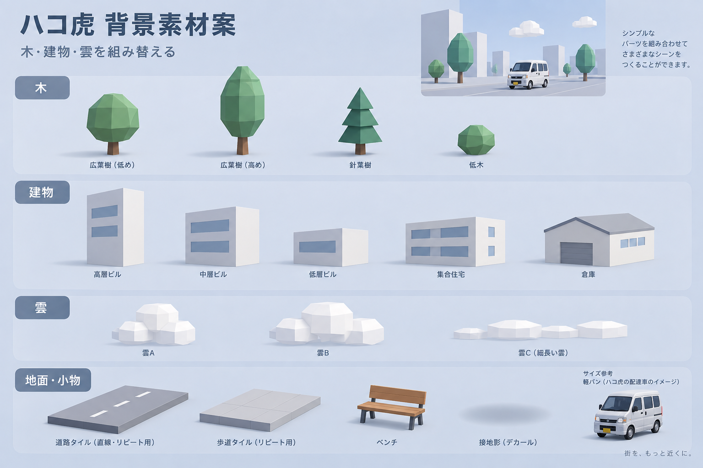

# ハコ虎ホーム用3D素材・制作ブリーフ

2026/09/23。画面方向は [ホーム設計](mobile-home-3d-2026-09.md) を参照。これは制作準備であり、以下の新規GLB・最適化モデルは未制作。

生成画像は形・色・密度の参考。文字や標語は製品へ採用しない。車は現行カタログの正しい車種を使い、画像生成の車をモデル原本にしない。

## 初回の制作範囲

最初はエブリイDA17V 1台と、木2種・建物3種・雲3種・道路・歩道・ベンチを揃える。背景の形は極低ポリ、車は実車のシルエットを優先する。小さな装飾、街路看板、窓の内部、遠景の車は作らない。

| 素材キー | 形状 | 1個あたりの初期目標tri | 材質 |
|---|---|---:|---|
| tree-a / tree-b | 細長い樹冠/丸い樹冠＋幹 | 60〜160 | 葉・幹 |
| shrub-a | 低い多面体 | 20〜60 | 葉を共有 |
| building-a / b / c | 高低・縦横比の違う直方体 | 12〜80 | 建物を共有 |
| warehouse-a（追加候補） | 低い箱＋屋根 | 24〜80 | 建物・屋根 |
| cloud-a / b / c | 箱形を組み合わせた低い雲 | 24〜120 | 雲を共有 |
| road-tile / sidewalk-tile | 繰り返し可能な平面と縁 | 2〜24 | 道路・歩道・白線 |
| bench-a | 座面・背・脚を簡略化 | 60〜180 | 木・脚 |
| contact-shadow | 車の接地影 | 2 | 小さな透過テクスチャ |

これは予算案。実際の同時表示数を含め背景2千tri程度に収める。木と建物はインスタンス化を検討し、数を増やすための個別材質コピーを避ける。休みは同じ素材で静かな公園を組む。

## 車両の派生版

- 原本は `~/Developer/assets/keivan-3d/`、Web採用版は `apps/web/src/lib/vehicleModelAssets.json` を照合する。既存Web GLBを上書きせず、mobile向けの別ファイル/ハッシュを作る。
- 同材質の静止部品を結合し、車体の部位色・窓・灯火・プレート・車輪を分離して保持する。車輪だけでなく車体全体を強く減面して外観を崩さない。
- `wheel_FL / wheel_FR / wheel_RL / wheel_RR` の4グループを確認し、中心・半径・ローカル回転軸をmanifestへ記録する。タイヤ/ホイールは回し、ホイールハウス/ハンドルは回さない。
- プレート位置と既存の字形/配置契約を保持する。左右ミラーや窓色、実車と異なる車種バッジを意図せず消さない。
- 目標8千〜1.5万tri、車1台32 draw calls以下。primitive数の減少は実機draw call数の検証と区別する。

## 寸法・軸・ファイル契約

- 単位はメートル。GLBランタイムの共通座標はY-up、車の前方を+Z、地面をY=0とする案。既存モデルの向きは実ファイルを確認し、取り込み時の親変換1つで正規化する。部品ごとに勝手に回転/縮尺を変えない。
- BlenderのZ-upから書き出す際の軸変換は往復インポートで確認する。車の原点は地面上の車体中心、樹木/建物/ベンチは底面中心。雲は形状中心とし高度はシーン側で持つ。
- 道路タイルは長さと接続端をmanifestに記録し、前後が継ぎ目なく循環する。法線・裏面・陰影の継ぎ目と原点ずれを確認する。
- 名前例: `scenery-tree-a.<hash>.glb`、`kei-every-da17v-mobile.<hash>.glb`。元ファイル、変換スクリプト版、SHA-256、寸法、向き、tri、材質数、primitive数、輪の情報を記録する。
- 原本 `.blend` は上記ローカル資産領域へ保存し、採用GLB/ポスター/manifestをアプリへ取り込む。未検証の途中版をカタログへ自動昇格させない。

## ライト・ダーク共用

形状は共用し、背景の意味別材質 `foliage / trunk / building / cloud / road / sidewalk` と環境光を差し替える。車両の塗装色はユーザーの車の情報を保持する。背景に明暗を焼き込んだ大きなテクスチャ、リアルタイム多灯影、反射用高解像度HDRは初期版では使わない。

テーマは昼夜と独立する。ダークでも車体の銀色と窓・タイヤの境界が見えること。開始アンバー、終了赤、稼働緑の見分けやすさは操作層で維持する。ポスターは同じGLB/カメラからライト・ダークを出し、撮影条件をmanifestに残す。

## 納品と受入

1. GLB、制作元と生成手順、manifest、前/後/左右/斜めの確認画像、ライト/ダークの静止ポスターを一組で用意する。新規背景は手続き的なBlender制作を基本とし、外部有料生成・素材購入は別途確認する。
2. glTFの構造検証、寸法/軸/法線、輪の回転、ガラスの描画順、材質色、個人情報の混入がないことを確認する。
3. 実機で必要な車1台だけロードし、稼働前/中/休み・背景化/復帰・動き停止・モデル読込失敗を検証する。読込や失敗で業務操作を止めない。
4. iPhone15で10分動かし、静止版とのframe time・操作応答・メモリ・発熱傾向を比較する。30fpsと合計50 draw calls以下は初期目標で、未計測。Androidは別端末で後日検証する。

第一段階の完了は「車1台と最小背景が隔離PoCで動き、静止表示へ戻せること」。画像モック完成と、モデル制作/実機性能検証の完了は分けて記録する。

## 初回制作結果（2026/09/23）

最初の車1台と背景11点を手続き的に制作/派生出力した。保存先は `apps/mobile/ui-preview/scene/assets/`、手順は同ディレクトリの親 [README](../../apps/mobile/ui-preview/scene/README.md)。車の原本は変更せず、4輪を明示的に分離し材質単位で統合。GLBとnative用scene JSON、制作manifest、同じモデル/カメラのライト/ダーク静止画を保存。背景は各点12〜60tri、素材GLB約55KB。

iPhoneでは動作表示をユーザー確認済み。ただし本番用の素材カタログ採用、実機10分の性能/熱、車番の共通字形による描画、各方向のモデル監査は未完。Macシミュレーターのsheetではソフトウェア描画の不具合が残り静止表示へ退避する。Macブラウザの隔離プレビューで同じ3Dシーンを確認できる。

## ミニチュア表現への調整（2026/09/23）

背景を写実化するより、車と背景の情報量を揃える方針で合意。不透明の青灰色の窓、接地を維持した車体だけの小さな上下動、背景の大きな窓/入口と葉のまとまりを共通シーンへ実装した。車種のシルエットと長押し/モーダル構成は維持。稼働前は静止、稼働/移動時のみ演出を動かす。完全なダークUIは後続。

現在の背景素材は11点/129,172bytes、各12〜336tri。シーン全体10,997tri/46 draw calls/texture 0。素材と4枚のポスターを再生成し、型検査とPC/スマホ幅・各状態・停止/動き軽減・失敗復旧を確認。今回の実機目視/長時間性能は未確認。実装と再生成手順は [scene README](../../apps/mobile/ui-preview/scene/README.md)。
