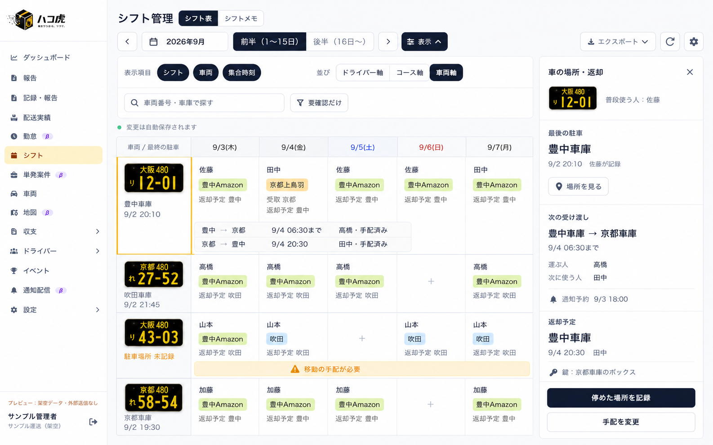
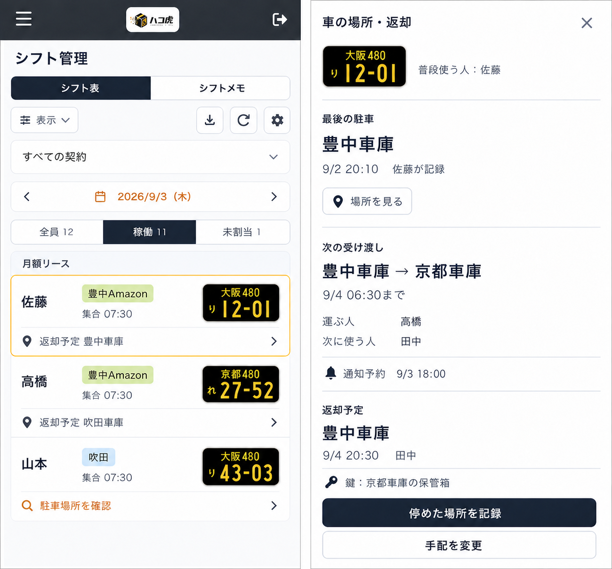

# シフト画面で車の場所・返却を確認するUI案

2026-09-01。ユーザー依頼はUI計画と画面画像の生成。**今回は静止画の検討案で、本番UI・API・DB・既存の操作プレビューは変更していない。** 前回の [移動・通知の試作](vehicle-handoffs-and-notifications.md) をシフト上にどう見せるかを整理する。

同日追加の方針: 駐車記録の最初の入口は**日報と同時の送信**とする。シフト詳細の単独記録も同じ基盤へ接続し、将来はモバイルの車両QR＋端末位置で入力できるようにする。[日報から始める共通基盤](daily-report-parking-foundation.md) を参照。生成画像はシフト側の表示案として維持し、日報の新しい入力欄はまだ画像・実装に含まない。

## 提案

普段のドライバー別シフトには返却先を短く1行だけ追加する。車ごとの移動を追いたいときは、既存「ドライバー軸／コース軸」に追加する「車両軸」へ切り替える。車を選ぶと、最後の駐車・次の受け渡し・返却予定がひとつの詳細にまとまる。

地図を常時表示する新しい管理画面にはしない。ナンバープレートと場所名で通常の判断を済ませ、詳細の「場所を見る」から必要なときだけ既存の地図につなぐ。駐車場所と配送コース・集合場所は別の情報として扱う。

## 画面案

### PC：車両軸と選んだ車の詳細

- 左の固定列はプレート＋最後の駐車場所＋記録日時。日付列は既存の半月表を維持し、表示幅に応じて横スクロールする。画像の9/3〜9/7は見えている部分であり、5日表示への仕様変更ではない。
- 各セルは利用する人・コース・受取／返却先。月額の紐付け先とは分け、実際の配車を車ごとにまとめる。同日複数便・複数人の利用を単一の利用者へ潰さない。
- 選んだ車の行だけ、豊中→京都／京都→豊中の手配を開く。移動先・期限・担当者を別々の手配として表示する。全車の行を常時高くしたり、別の行をまたぐ矢印を重ねたりしない。
- 右に「車の場所・返却」を表示する。表に重ならず、閉じると表の表示幅が戻る。狭いPC・タブレットでは無理に二分せず、スマホと同じ詳細表示へ切り替える。
- 車両軸では契約区分での段分けを出さない。車両番号・車庫での検索と「要確認だけ」を使う。ドライバー軸へ戻したときは、元の契約条件と表示位置を保持する。

### スマホ：通常シフトから詳細を開く

- 左が通常のシフト、右が車を選んだ後の詳細という**別々の画面状態**。スマホで2画面を横並びにはしない。
- 氏名・コース・プレートの現在の並びを維持し、その下に「返却予定 豊中車庫」を1行追加する。注意が必要なら同じ場所に「駐車場所を確認」などを表示し、細かい注釈を積み重ねない。
- 返却先の行を押すと詳細を開く。既存の配車編集操作とは押す場所を分け、buttonの入れ子を作らない。ホバーや小さなアイコンだけに頼らず、行全体を44px以上の操作対象にする。
- 詳細は縦スクロール。「停めた場所を記録」「手配を変更」を下部に固定し、本文がボタンの下へ隠れない余白を確保する。閉じると元の日付・ドライバー行へ戻る。
- エクスポートは従来のダウンロード1アイコンを維持する。戻り先や操作に必要のない容量・実装説明は追加しない。

## 情報の意味と優先順位

| 表示 | 意味 | 更新する操作 |
| --- | --- | --- |
| 最後の駐車 | 実際に停めた場所の最新記録。記録者・日時付き | 「停めた場所を記録」を保存したとき |
| 次の受け渡し | 前の利用から次の利用への予定。出発地・届け先・期限・運ぶ人 | 配車から引き継いで手配を確定・変更したとき |
| 返却予定 | どこへ・誰が・いつ返す予定か | 返却の手配を確定・変更したとき |
| 通知予約 | 誰にいつ連絡するか | 文面・宛先・日時を確認して予約したとき |

「最後の駐車」はリアルタイムの現在地とは呼ばない。シフトの開始・終了や期限到来だけで停車中・返却済みへ変えない。記録後に別の利用や移動があった場合は、古い場所を現在地として強調せず「駐車場所を確認」を出せるようにする。単なる経過時間だけで未返却と断定しない。

日別セルの返却表示はその利用に対する予定。詳細の「次の受け渡し」「返却予定」には必ず日付を付け、最後の駐車記録と区切る。過去日を選んだ場合は、その日の返却実績と現在の最後の記録を混同しない見出しにする。

## 記録する操作

1. 車を選んで「停めた場所を記録」。選んだ車と関連する利用・返却予定を引き継ぐ。
2. 実際の駐車場所・日時を確認する。必要なら区画・鍵の連絡を追記する。予定先は候補として示すが、未確認のまま実績にはしない。
3. 保存成功後に駐車記録と関連する返却状態を更新する。予定と違う場所なら実際の場所を記録し、元の手配は「要確認」に残す。
4. 保存失敗では入力を残し、一覧の駐車記録を更新しない。管理者の代理記録と本人の記録を履歴で識別する。

通知は引き続き「次の利用日の前日○時」を基本案とし、手配ごとに上書きできる。宛先・給油の役割・変更／取消は前回の計画を維持する。駐車場所の記録と通知送信は別の結果として扱う。

## 未設定・変更時の表示

| 状況 | 一覧 | 詳細で行うこと |
| --- | --- | --- |
| 駐車記録がない | 駐車場所 未記録 | 実際の場所を記録 |
| 別の車庫で次に使うが手配がない | 移動の手配が必要 | 出発地・届け先・担当・期限を確認 |
| 返却先が決まっていない | 返却先 未設定 | 返却先と日時を設定 |
| 返却予定を過ぎたが記録がない | 返却を確認 | 状況を確認して実績を記録。所在は推測しない |
| 予定と違う場所に停めた | 返却先を確認 | 実際の場所は保持し、残る移動を手配 |
| 通知が送れなかった | 対象の手配に通知未送信 | 詳細で宛先確認・再予約 |

必要な注意だけをアンバーで表示する。色だけで意味を伝えず短い言葉を併用する。通知の時刻・細かな鍵の連絡は詳細にまとめ、通常のシフト一覧に常時並べない。

## 見た目の方針と再利用元

- 対象は軽配送の配車担当者。画面の仕事は、同じ車が「どこに停めた記録があり、次にどこで使い、どこへ戻るか」をシフトを見ながら判断できること。
- 配色は既存の背景 `#f8fafc`、白 `#ffffff`、枠 `#e2e8f0`、本文 `#475569`、主要操作 `#1e293b`、選択・要確認 `#fbbf24`。コースの色と車両プレートの黒／黄を維持する。
- 書体は現在のHiragino系日本語ゴシックを継続。見出しを太字、本文・操作は14px相当、表の補足は12px相当を目安にする。画像は配置案でありピクセル単位の実装指定ではない。
- 実シフト `apps/web/src/app/(admin)/admin/(ops)/shifts/page.tsx` を直接描画する3193番の隔離プレビューを、PC1440×1000・スマホ390×844で確認し、生成の参照画像に使用した。ロゴ・サイドバー・月／半月操作・タブ・プレート・日別一覧を土台にした。
- 実装時は `ShiftDisplayPanel`・`ShiftDisplayOptions` の既存の表示切替に追加する。プレート、選択、日付、時刻、開閉、確認、短い補足は既存共通部品を再利用し、通知の試作を移動編集の土台とする。
- 大きな地図、新しいダッシュボード、常時表示する通知チップ群は採らない。選んだ車だけ前後の動きを開く点をこの案の中心にした。

## 次の実装順序と検証

1. 日報を入力窓口とする共通基盤を設計し、実日報を再利用した隔離プレビューで駐車場所の同時送信を試作する。既存のシフトプレビューにもその架空記録と返却予定を追加し、通常シフトの1行表示と詳細開閉・記録・再表示を実装する。
2. 同じデータで車両軸、車両ごとの前後の予定、移動手配、要確認の絞り込みを実装する。元の配車編集・車両割当・日付移動・表示期間を保つ。
3. PC・320／390px幅で、長い場所名、同日複数便、期間外の返却、未設定、保存失敗、取消、予定と異なる場所、未保存保護、キーボード操作、固定フッターを検証する。画像／PDFには表に必要な情報だけを反映し、詳細パネルや操作ボタンは出力しない。
4. 本番接続は [車両移動・通知の条件](vehicle-handoffs-and-notifications.md) に沿って別途実施する。会社・権限・配車の一括保存、予定と実績の分離、通知予約・変更・取消・重複抑止を検証する。古い駐車設計と現行の地点／所在テーブルは実装前に整理し、未作成の提案テーブルを既存として扱わない。

今回確認したのは既存画面の表示と生成画像の日本語・階層・予定／記録の分離。新UIの操作・保存・レスポンシブ動作を検証したわけではない。画像は内蔵image_genで生成し、不要な契約フィルターと鍵の文言を修正した。最終プロンプト一式は [生成記録](shift-vehicle-location-ui-prompts.md) に残す。
